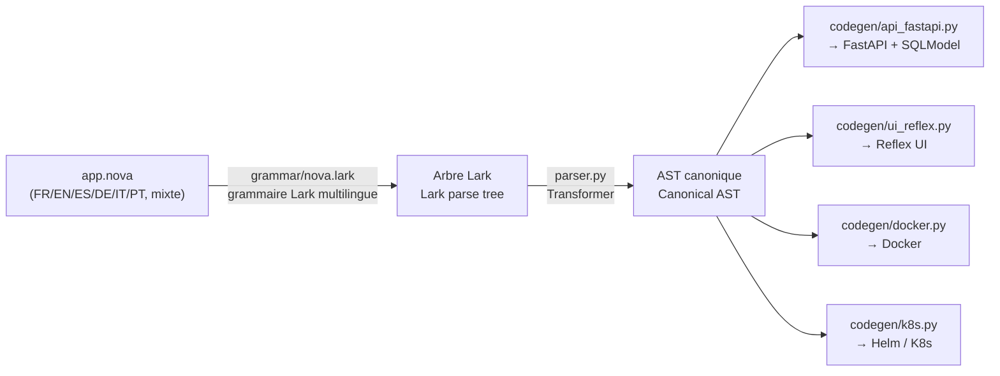

<div align="center">


# NOVA

**Un DSL multilingue (FR/EN/ES/DE/IT/PT) d'intention métier qui compile vers une API FastAPI (auth JWT, requêtes déclaratives), une UI Reflex stylable en CSS, des images Docker et des manifests Kubernetes/Helm.**
**A multilingual (FR/EN/ES/DE/IT/PT) business-intent DSL that compiles to a FastAPI API (JWT auth, declarative queries), a CSS-stylable Reflex UI, Docker images and Kubernetes/Helm manifests.**


[🇫🇷 Français](#-français) · [🇬🇧 English](#-english) · [Démarrage rapide](#démarrage-rapide--quickstart) · [Architecture](#architecture-du-compilateur--compiler-architecture) · [Référence des mots-clés (6 langues)](docs/REFERENCE.md) · [Licence](#licence--license)

</div>

---

Ce dépôt contient le compilateur NOVA (`nova_compiler/`), sa CLI (`nova`),
des exemples (`examples/`), les tests (`tests/`) et l'extension Visual
Studio Code (`vscode-extension/`) pour écrire des fichiers `.nova` avec
coloration syntaxique et snippets dans les deux langues.

This repo contains the NOVA compiler (`nova_compiler/`), its CLI (`nova`),
examples (`examples/`), tests (`tests/`), and the Visual Studio Code
extension (`vscode-extension/`) for writing `.nova` files with syntax
highlighting and snippets in either language.

> **Fair-source / Code source ouvert** — NOVA est distribué sous
> [Business Source License 1.1](LICENSE.md) : le code est ouvert et
> lisible par tous dès aujourd'hui, gratuit pour tout usage
> non-commercial, et bascule automatiquement sous licence Apache 2.0
> (100% permissive) quatre ans après chaque publication. Un usage
> commercial nécessite une licence payante — écrivez à
> **contact@enc-soft.com**. Voir [Licence](#licence--license) en bas de
> page pour le détail.
>
> NOVA is distributed under the [Business Source License 1.1](LICENSE.md):
> the code is open and readable by everyone today, free for any
> non-commercial use, and automatically converts to the fully permissive
> Apache 2.0 license four years after each release. Commercial use
> requires a paid license — reach out to **contact@enc-soft.com**. See
> [License](#licence--license) at the bottom of this page for details.

## Démarrage rapide / Quickstart

```bash
git clone git@github.com:Encryon/Nova.git nova-framework
cd nova-framework
python3 -m venv .venv && source .venv/bin/activate
pip install -e ".[dev]"

nova new mon_projet --lang fr        # ou --lang en
nova check mon_projet/app.nova
nova compile mon_projet/app.nova -o mon_projet/build
cd mon_projet/build && docker compose up --build
```

Backend sur `http://localhost:8000/docs` · Frontend sur `http://localhost:3000`.

## Architecture du compilateur / Compiler architecture



Le point clé : **tout le reste du compilateur ne voit jamais le texte
source**, seulement l'AST canonique — ajouter une langue ou un synonyme se
fait uniquement dans `nova_compiler/keywords.py` et la grammaire.
The key point: **the rest of the compiler never looks at the source
text**, only at the canonical AST — adding a language or a synonym only
touches `nova_compiler/keywords.py` and the grammar.

---

## 🇫🇷 Français

### Qu'est-ce que NOVA ?

NOVA est un langage d'intention métier : on décrit des **entités**, des
**API** et des **pages** à un niveau fonctionnel, et le compilateur génère
le code technique correspondant (modèles de données, routes CRUD, UI,
conteneurs, déploiement). Chaque mot-clé du langage existe en français et
en anglais et compile vers exactement le même arbre syntaxique — un même
fichier peut même mélanger les deux.

Stack cible actuelle (v0.2) : **Python / FastAPI** pour l'API,
**Reflex** (thème Radix, navigation, cartes) pour l'UI web, **Docker**
pour l'empaquetage, **Kubernetes (Helm, Traefik, HPA)** pour le
déploiement cloud-native. Authentification JWT avec rôles, requêtes
déclaratives au-delà du CRUD, et style CSS piloté depuis le DSL sont
disponibles en un bloc chacun — voir plus bas.

Chaque mot-clé du langage est reconnu en **6 langues** : français,
anglais, espagnol, allemand, italien, portugais — un même fichier peut
mélanger n'importe laquelle d'entre elles, elles compilent toutes vers
le même arbre syntaxique.

### Installation

```bash
cd nova-framework
python3 -m venv .venv && source .venv/bin/activate   # optionnel mais recommandé
pip install -e ".[dev]"
```

Installe la commande `nova` (voir `pyproject.toml`, `[project.scripts]`)
et les dépendances de dev (`pytest`).

### Syntaxe du DSL

```
application MaBoutique {
  nom: "Ma Boutique"
  langue: fr
}

entité Utilisateur {
  champ nom: chaine requis
  champ email: chaine requis unique motif = "^[^@]+@[^@]+$"
  champ age: entier
}

entité Commande {
  champ montant: decimal requis
  appartient_à Utilisateur
}

api Utilisateur {
  liste
  créer
  modifier
  supprimer
}

page ListeUtilisateurs {
  afficher Utilisateur comme table titre "Utilisateurs"
}
```

Voir `examples/blog.fr.nova` pour un exemple complet, et `examples/mixed.nova`
pour un fichier qui mélange français et anglais.

### Table des mots-clés

| Bloc / mot-clé | Français | Anglais |
|---|---|---|
| Application | `application` | `app` |
| Entité | `entité` / `entite` | `entity` |
| Champ | `champ` | `field` |
| Requis | `requis` | `required` |
| Unique | `unique` | `unique` |
| Validation regex | `motif` / `regex` | `pattern` |
| Valeur par défaut | `defaut` / `défaut` / `par_defaut` | `default` |
| Relation 1-N | `possede_plusieurs` / `possède_plusieurs` | `has_many` |
| Relation N-1 | `appartient_a` / `appartient_à` | `belongs_to` |
| API | `api` | `api` |
| Lister | `liste` | `list` |
| Créer | `creer` / `créer` | `create` |
| Modifier | `modifier` / `mettre_a_jour` / `mettre_à_jour` | `update` |
| Supprimer | `supprimer` | `delete` |
| Obtenir | `obtenir` / `lire` | `get` |
| Page | `page` | `page` |
| Afficher | `afficher` | `show` |
| Comme | `comme` | `as` |
| Titre | `titre` | `title` |
| Style | `style` | `style` / `css` |
| Auth | `authentification` | `auth` / `authentication` |
| Rôles | `rôles` / `roles` | `roles` |
| Protéger | `proteger` / `protéger` | `protect` |
| Requête | `requete` / `requête` | `query` |
| Filtre | `filtre` | `filter` |
| Trier par | `trier_par` | `sort_by` / `order_by` |
| Limite | `limite` | `limit` |
| Types | `chaine`/`chaîne`, `texte`, `entier`, `decimal`/`décimal`, `booleen`/`booléen`, `date`, `date_heure`, `fichier`, `image`, `couleur` | `string`, `text`, `int`, `float`, `bool`, `date`, `datetime`, `file`, `image`, `color` |
| Base de données | `base_donnees` / `base_données` | `database` |

Ce tableau ne couvre que FR/EN pour rester lisible ; espagnol, allemand,
italien et portugais sont acceptés pour les mêmes mots-clés (y compris
les blocs `style`/`auth`/`requete` ajoutés récemment) — voir la
**[référence complète en 6 langues](docs/REFERENCE.md)** pour le détail
mot-clé par mot-clé, avec un exemple complet dans chacune des 4 langues
ajoutées.

### Validation par expression régulière

Un champ texte peut porter une contrainte `motif`/`pattern`/`regex` :

```
champ email: chaine requis motif = "^[^@]+@[^@]+$"
```

Génère automatiquement une contrainte Pydantic (`pattern=r"..."`) sur le
modèle de table SQLModel et sur les schémas `Create`/`Update` — l'API
rejette une valeur invalide avec un `422` sans code de validation à
écrire à la main.

### Validation croisée entre champs (`validation`)

Au-delà de `motif`/`pattern` (un seul champ), un bloc `validation <Nom>
sur <Entité> { regle: <expression> <comparateur> <expression> message:
"..." }` (une ou plusieurs règles) valide l'état complet de
l'enregistrement à la création ET à la modification :

```
validation FactureCoherente sur Facture {
  regle: prix_ttc == prix_ht + frais_port message: "Le TTC doit valoir HT + frais de port."
  regle: min(prix_ht, remise) >= 0 message: "Le prix HT et la remise doivent être positifs ou nuls."
}
```

Chaque `<expression>` peut être un simple champ, une constante, une
combinaison par `+`/`-`, ou un appel de fonction : `min`, `max`
(au moins 2 arguments), `round` (1 ou 2 arguments, arrondi façon Python),
`abs` (1 argument) — au-delà de deux champs comparés directement, comme
dans l'exemple ci-dessus. Un champ combiné par une fonction ou `+`/`-`
doit être numérique (`entier`/`decimal`) ; un champ nu seul de chaque côté
d'un opérateur d'ordre (`>`/`<`/`>=`/`<=`) peut en revanche être une
`date`/`date_heure`. Si un des champs référencés est vide (optionnel non
renseigné), la règle est silencieusement désactivée plutôt que de lever
une erreur. Reste limité à des champs d'une même entité (pas de
sous-requête, pas de comparaison avec un autre enregistrement) ; pour ça,
`routers_custom/`.

### Base de données : moteur SQL configurable et backend NoSQL MongoDB

Par défaut, le projet généré utilise **SQLite** (fichier local, aucune
dépendance externe). Le bloc `application` accepte une propriété
`base_donnees`/`base_données` (`database` en anglais) pour choisir un
autre moteur :

```
application MonApp {
    base_donnees: postgresql
}
```

Valeurs reconnues (avec alias courants, insensibles à la casse) :
`sqlite` (défaut), `postgresql`/`postgres`/`postgre`, `mysql`/`mariadb`/
`maria`, `sqlserver`/`sql_server`/`mssql`, `oracle`, et `mongodb`/`mongo`.
Une valeur inconnue est rejetée à la compilation avec la liste des
valeurs valides.

**Moteurs SQL (`postgresql`, `mysql`, `sqlserver`, `oracle`)** —
le backend généré reste un projet SQLModel classique : l'URL de connexion
par défaut, la dépendance pilote requise (`psycopg2-binary`, `pymysql`,
`pyodbc`, `oracledb`) et le service `db:` du `docker-compose.yml`
(image officielle, identifiants de dev, volume persistant) sont ajustés
automatiquement pour le moteur choisi ; le chart Helm (`values.yaml`)
reçoit la même URL par défaut. `sqlite` ne change rien par rapport au
comportement historique (pas de service `db:`, volume `backend_data`
partagé avec les uploads).

**Backend NoSQL (`mongodb`/`mongo`)** — chemin de génération entièrement
différent : modèles [Beanie](https://beanie-odm.dev/) (`Document` async
sur Motor/`AsyncIOMotorClient`) au lieu de tables SQLModel, routes CRUD
`async`/`await`, identifiants sous forme de chaîne (ObjectId Mongo
sérialisé) au lieu d'entiers auto-incrémentés, contrainte `unique`
traduite en index Mongo unique (`pymongo.errors.DuplicateKeyError`
intercepté et renvoyé en `422`, comme le backend SQL). L'authentification
JWT, les notifications email, l'upload de fichiers, le contenu
multilingue, `belongs_to` et les graphiques sur entité sont **tous
supportés** et réutilisent le code backend-agnostique existant. Le bloc
`requete`/`query` (filtres déclaratifs, tri, limite), le bloc
`calendar`/`calendrier` (export `.ics` inclus) et les relations
`has_many`/`possede_plusieurs` matérialisées (résumé texte sur
`liste`/`obtenir`) sont **également supportés**, avec les mêmes routes
que le backend SQL, portées vers l'API async Motor/Beanie. Seule
exception : dans ce MVP, `database: mongodb` reste **incompatible** avec
la **jointure explicite** (`jointure:`/`join:` dans un bloc `requete`) —
absence de `JOIN` natif côté MongoDB, contrairement à SQL.

Cette combinaison est détectée et rejetée **à la compilation** (erreur
explicite nommant la ou les requêtes concernées) plutôt que de générer un
projet Mongo silencieusement incomplet — au-delà, `routers_custom/`.

### Migrations de schéma (`nova migrate`)

Pour un moteur **SQL** (pas MongoDB — voir ci-dessus, sans schéma figé à
migrer), chaque projet généré embarque une structure
[Alembic](https://alembic.sqlalchemy.org/) complète : `backend/alembic.ini`,
`backend/migrations/env.py` (déjà câblé sur `app.database`/`app.models`,
donc sur `NOVA_DATABASE_URL` au runtime — rien à configurer) et
`backend/migrations/versions/`. Comme `routers_custom/` (voir plus bas),
cette structure est générée **une seule fois** par `nova compile` : jamais
réécrite ensuite, pour ne jamais perdre l'historique réel des révisions
déjà appliquées en production.

```
nova migrate app.nova -o build -m "ajoute le champ prix"
```

Cette commande compile le projet (régénère `models.py` et le reste comme
`nova compile`), puis exécute — dans `build/backend/` — un `alembic
revision --autogenerate` (compare l'état actuel des modèles au dernier
schéma connu et écrit une nouvelle révision dans `migrations/versions/`)
suivi d'un `alembic upgrade head` (l'applique réellement à la base pointée
par `NOVA_DATABASE_URL`). Comme pour `nova run` et `docker compose`,
`alembic` doit être installé dans l'environnement Python qui exécute la
commande `nova` elle-même (il l'est déjà dans `backend/requirements.txt`
pour le déploiement).

**À savoir en adoptant `nova migrate` sur un projet déjà démarré au moins
une fois** : par défaut, `app/main.py` appelle `init_db()`
(`SQLModel.metadata.create_all`) au démarrage, qui crée directement les
tables manquantes sans passer par Alembic. Si la base cible a déjà été
créée ainsi, la toute première `nova migrate` générerait une révision qui
tenterait de recréer des tables déjà existantes (échec `table already
exists`) — solution standard Alembic, pas spécifique à NOVA : lancez
`alembic stamp head` une fois dans `backend/` pour marquer le schéma
existant comme à jour sans le rejouer, puis utilisez `nova migrate`
normalement pour la suite. Pour un tout nouveau projet, lancer `nova
migrate` avant le tout premier démarrage de l'application évite le
problème.

### Style et CSS

Le bloc `application` accepte une propriété `css` (ou `feuille_style` /
`stylesheet`) : le fichier référencé, résolu relativement au `.nova`
source, est copié tel quel dans les assets du frontend Reflex généré et
chargé globalement (`rx.App(stylesheets=[...])`).

```
application MaBoutique {
  nom: "Ma Boutique"
  css: "theme.css"
}
```

Chaque `show` d'une page accepte en plus un bloc `style { ... }` (ou
`css { ... }`) libre : une clé connue (`couleur_fond`, `arrondi`,
`police`, `taille_police`, `epaisseur`, `marge`, `espacement`, `ombre`,
`largeur`, `hauteur`, `bordure`, `couleur`...) est traduite vers la
vraie propriété CSS ; toute autre clé passe telle quelle (snake_case ou
kebab-case, convertie en camelCase pour Reflex) — pas besoin d'attendre
que NOVA connaisse une propriété CSS pour l'utiliser. La clé spéciale
`classe` (ou `class`/`class_name`) injecte un `class_name=` Reflex,
utile pour accrocher une classe définie dans la feuille externe :

```
page Produits {
  afficher Produit comme table titre "Catalogue" style {
    couleur_fond: "#445566"
    arrondi: "12px"
    classe: "carte-produit"
  }
}
```

Voir `examples/full_featured.nova` et `examples/theme.css`.

### Authentification JWT et rôles

Un bloc `auth` optionnel (une seule fois par projet) active
l'authentification complète — table utilisateur, hachage de mot de
passe (`bcrypt`), jetons JWT (`python-jose`), routes `/auth/register`,
`/auth/login`, `/auth/me`, et une page de connexion Reflex générée
automatiquement (jeton persisté dans un cookie navigateur) :

```
auth {
  roles: admin, user, editeur
}
```

Une `api` se protège avec `proteger: <rôle>` (ou `protect`/`protéger`) :
toutes ses routes exigent alors un jeton valide portant ce rôle — un
utilisateur `admin` passe toujours, quel que soit le rôle requis.

```
api Produit {
  liste
  créer
  modifier
  supprimer
  proteger: admin
}
```

En production, définissez la variable d'environnement
`NOVA_JWT_SECRET` (le `docker-compose.yml` généré la référence déjà) —
la valeur par défaut ne doit jamais être utilisée telle quelle.
`/auth/register` ne porte pas de champ `role` : seul le tout premier
compte créé sur le projet devient automatiquement `admin` (bootstrap
sans identifiants par défaut à changer), tous les suivants reçoivent le
rôle par défaut ; un admin peut ensuite promouvoir un autre compte via
`PATCH /auth/users/{id}/role`. Pensez à créer votre propre compte
immédiatement après le déploiement.

### Requêtes déclaratives (`requete` / `query`)

Pour aller au-delà du CRUD simple sans écrire de route à la main, un
bloc `requete ... sur <Entité> { ... }` (ou `query ... on`/`query ...
from`) compile vers une route `GET` dédiée avec filtre, tri et limite :

```
requete ProduitsChers sur Produit {
  filtre: prix > 100
  trier_par: prix desc
  limite: 10
}
```

Génère `GET /requetes/produits-chers`, une requête SQLAlchemy lisible
(`select(...).where(...).order_by(...).limit(...)`) — pas de chaîne SQL
à écrire. Les comparateurs disponibles : `>`, `<`, `>=`, `<=`, `==`,
`!=`. Plusieurs `filtre:` au niveau racine se combinent en ET ; un bloc
`ou: { filtre: ... filtre: ... }` regroupe des filtres combinés en OU
(le groupe entier restant combiné en ET avec le reste, plusieurs blocs
`ou:` possibles) :

```
requete ProduitsAConsulter sur Produit {
  filtre: stock > 0
  ou: {
    filtre: prix < 20
    filtre: promo == vrai
  }
}
```

Une `jointure: <Entité> sur <local> = <distant>` (alias `join`/`union`/
`verknüpfung`/`junção`) relie explicitement une autre entité — les champs
de l'entité jointe se référencent alors avec le préfixe `<Entité>.` dans
`filtre:`/`trier_par:` (un champ sans préfixe reste résolu contre
l'entité principale, comportement historique inchangé) :

```
requete AccessoiresAvecProduit sur Accessoire {
  jointure: Produit sur produit_id = Produit.id
  filtre: Produit.prix > 100
}
```

Chaque enregistrement de la réponse porte alors les champs de l'entité
principale à plat, plus une clé nommée d'après l'entité jointe
(`produit: { id, nom, prix, ... }`). Une seule jointure a été illustrée
ci-dessus, mais plusieurs `jointure:` sont acceptées dans le même bloc
(chacune pouvant référencer une entité déjà jointe, pas seulement
l'entité principale). Reste limité aux jointures déclarées explicitement
(pas d'inférence automatique depuis `appartient_a`/`possede_plusieurs`,
même quand la relation existe déjà) ; pour une logique plus riche
(agrégations, sous-requêtes), `routers_custom/`.

### Graphiques (`chart`)

Un bloc `chart <Nom> sur <Entité|Requête> { ... }` génère automatiquement
sa propre page Reflex (route `/graphiques/<nom>`, lien ajouté à la barre
de navigation) affichant un graphique [Recharts](https://recharts.org/)
— aucune dépendance Python supplémentaire à installer, `rx.recharts` est
fourni avec Reflex :

```
chart RepartitionPrix sur Produit {
  type: barres
  axe_x: nom
  axe_y: prix
  titre: "Prix par produit"
}
```

`sur` référence soit une **entité** (les données viennent alors de son
API liste — protection JWT héritée automatiquement si `api <Entité> {
... proteger: <rôle> }` est présent), soit une **requête déclarative**
déjà définie plus haut dans le fichier (données déjà filtrées/triées,
toujours publique) :

```
chart TopProduitsChers sur ProduitsChers {
  type: camembert
  axe_x: nom
  axe_y: prix
}
```

Types disponibles (`type:`) : `bar`/`barres`, `line`/`ligne`,
`pie`/`camembert`, `area`/`aire`, `radar`/`araignée`,
`scatter`/`nuage_de_points`, `donut`/`anneau`, `funnel`/`entonnoir` —
chacun avec ses synonymes dans les 6 langues. `axe_y` accepte plusieurs
champs séparés par des virgules pour un graphique multi-séries
(`axe_y: ventes, couts, marge`), sur les types qui s'y prêtent
(`bar`/`line`/`area` — rejeté à la compilation sur
`pie`/`radar`/`scatter`/`donut`/`funnel`, qui n'ont pas de rendu
multi-séries naturel). Une référence `sur` inconnue (ni entité ni
requête) est détectée à la compilation (`nova check`/`nova compile`),
pas au premier chargement de la page.

**Agrégation (`agregation`/`aggregation`)** : regroupe les lignes par
`axe_x` puis agrège `axe_y` avec une fonction (`compte`/`count`,
`somme`/`sum`, `moyenne`/`avg`, `min`, `max` — synonymes dans les 6
langues), calculée côté frontend (aucune requête backend
supplémentaire, juste un post-traitement en Python des lignes déjà
reçues) :

```
chart NombreProduits sur Produit {
  type: barres
  axe_x: categorie
  agregation: compte
  titre: "Nombre de produits par catégorie"
}
```

`compte`/`count` n'a pas besoin de `axe_y` (compte simplement les
lignes de chaque groupe) ; les autres fonctions l'exigent (un champ
numérique à agréger) — une valeur manquante ou non numérique dans
`axe_y` est ignorée silencieusement plutôt que de faire échouer le
calcul. Une fonction d'agrégation inconnue, ou une agrégation sans
`axe_x`, est détectée à la compilation.

### Composants UI riches : upload, images, couleurs, pickers natifs

Trois nouveaux types de champ génèrent des composants Reflex dédiés
plutôt qu'un simple `<input>` texte — aucune dépendance Python ou JS
supplémentaire, uniquement des composants Reflex/HTML5 natifs :

```
entité Produit {
  champ nom: chaine requis
  champ photo: image
  champ fiche: fichier
  champ couleur: couleur
}
```

- **`fichier`/`file`** et **`image`/`image`** : le formulaire généré
  affiche une zone de dépôt (`rx.upload`) avec aperçu du nom de fichier
  sélectionné ; à la soumission, le fichier est envoyé au backend via
  `POST /uploads/` (endpoint généré automatiquement dès qu'un champ
  `fichier`/`image` existe quelque part dans le projet), stocké sous un
  nom unique dans le volume `backend_data` déjà utilisé par SQLite, et
  re-servi statiquement sous `/files/<nom>`. Le champ stocke simplement
  cette URL (`str`) — aucune colonne binaire en base. Taille max 10 Mio
  par défaut (`NOVA_UPLOAD_MAX_BYTES`), extensions autorisées
  restreintes par défaut (`NOVA_UPLOAD_ALLOWED_EXTENSIONS`, rejet en
  415 hors liste), et une image dépassant 2000px de large est
  automatiquement redimensionnée (Pillow, `NOVA_UPLOAD_MAX_IMAGE_DIMENSION`)
  — les trois réglages sont surchargeables sans recompiler.
- **`couleur`/`color`** : un sélecteur de couleur natif
  (`type="color"`).
- Les types existants **`date`**, **`date_heure`**/`datetime` et
  **`entier`**/`decimal` (`int`/`float`) obtiennent eux aussi un widget
  natif adapté (`type="date"`, `type="datetime-local"`,
  `type="number"`) au lieu d'un simple champ texte.

Le rendu **tableau** et **carte** (`comme table` / `comme carte`) est
également enrichi automatiquement : une **miniature cliquable** pour
`image`, un **lien de téléchargement** pour `fichier`, une **pastille
de couleur** pour `couleur`, et un **badge Oui/Non** coloré pour
`booleen` — au lieu d'afficher la valeur brute.

Comme pour les champs `image`/`fichier`, `docker-compose.yml` reçoit
alors automatiquement une variable `NOVA_PUBLIC_BACKEND_URL` distincte
de `NOVA_BACKEND_URL` : la première doit être joignable **depuis le
navigateur de l'utilisateur** (aperçus d'image, liens de
téléchargement), la seconde reste l'URL interne Docker utilisée pour
les appels serveur-à-serveur — les deux diffèrent dès qu'on sort du
`docker compose up` local.

### Notifications par email (`email` + `notifier:`)

Un bloc `email { ... }` optionnel (une fois par projet) déclare la
configuration SMTP par défaut ; l'option `notifier:` sur un bloc `api`
déclenche l'envoi d'un email simple après chaque action listée :

```
email {
  hote: "smtp.mailtrap.io"
  port: 2525
  expediteur: "noreply@boutique.fr"
  destinataire: "ops@boutique.fr"
}

api Produit {
  creer
  supprimer
  notifier: creer, supprimer
}
```

Génère `backend/app/emailer.py` (fonction `send_email`, `smtplib` de la
bibliothèque standard — **aucune dépendance Python supplémentaire**) et
appelle automatiquement cette fonction à la fin des gestionnaires
`creer`/`modifier`/`supprimer` listés après `notifier:` dans le routeur
généré. Comportements à connaître :

- **Le mot de passe SMTP n'est jamais écrit dans le fichier `.nova`** :
  aucune propriété du bloc `email` ne le porte. Il est fourni au runtime
  exclusivement via la variable d'environnement `NOVA_SMTP_PASSWORD`
  (`docker-compose.yml` reçoit une ligne `NOVA_SMTP_PASSWORD: ""` à
  compléter) — même principe que `NOVA_JWT_SECRET` pour l'authentification.
  Les autres propriétés (`hote`/`port`/`utilisateur`/`expediteur`/
  `destinataire`/`tls`) sont surchargeables sans recompiler via
  `NOVA_SMTP_HOST`/`NOVA_SMTP_PORT`/`NOVA_SMTP_USER`/`NOVA_SMTP_FROM`/
  `NOVA_SMTP_TO`/`NOVA_SMTP_TLS`.
- **Un échec d'envoi n'interrompt jamais la requête** : `send_email` capture
  toute erreur (serveur injoignable, identifiants invalides...) et la
  logue en `warning` — une création/modification/suppression réussit
  toujours même si l'email n'est pas parti. Une notification est un
  effet de bord, pas une garantie.
- `notifier:` n'accepte que `creer`/`modifier`/`supprimer` (lister/obtenir
  n'a pas de sens à notifier) et nécessite qu'un bloc `email { ... }`
  soit déclaré quelque part dans le fichier — sinon `nova check`/`nova
  compile` refuse de compiler plutôt que de produire un projet dont la
  notification échouerait silencieusement.
- L'email envoyé est HTML (avec repli texte brut, `multipart/alternative`) ;
  `destinataire: <champ>` (alias `recipient:`) sur `api`, à côté de
  `notifier:`, envoie à l'adresse contenue dans ce champ de
  l'enregistrement concerné plutôt qu'au destinataire fixe du bloc
  `email` ; `piece_jointe: <champ>` (alias `attachment:`) joint le
  fichier référencé par un champ `fichier`/`image` de l'enregistrement :

  ```
  api Commande {
    creer
    notifier: creer
    destinataire: email_client
    piece_jointe: facture
  }
  ```

  Par défaut, le contenu du message (sujet + corps HTML bilingue
  mentionnant l'entité et son id) est généré automatiquement. Pour le
  personnaliser sans toucher au code généré, `template`/`modele` sur le
  bloc `email` référence un **fichier HTML externe**, résolu relativement
  au fichier `.nova` source :

  ```
  email {
    hote: "smtp.mailtrap.io"
    modele: "email_notification.html"
  }
  ```

  Ce fichier peut contenir des `{{champ}}` (nom de champ NOVA, ex.
  `{{nom}}`, `{{prix}}`, ou `{{client_id}}` pour une référence
  `belongs_to`) remplacés par la valeur correspondante de l'enregistrement
  concerné au moment de l'envoi (`{{action}}` : `created`/`updated`/
  `deleted`, et `{{entity}}` sont aussi disponibles) ; une balise
  `<title>...</title>` dans le HTML (une fois les `{{...}}` substitués)
  devient le sujet de l'email — sans `<title>`, un sujet générique
  bilingue est utilisé. Le corps texte brut (repli `multipart/
  alternative`) est dérivé automatiquement du HTML (balises retirées).
  Comme pour `application { css: "..." }`, le fichier référencé est
  copié tel quel au moment de la compilation (`nova compile`) ; s'il est
  introuvable, un placeholder est généré à la place plutôt que de faire
  échouer la compilation. Sans `template:`, le comportement historique
  (sujet/corps codés en dur) est inchangé ; pour un contenu entièrement
  programmatique, appelez `send_email(subject=..., body=..., to=...,
  attachment_path=...)` depuis `routers_custom/`.

### Calendrier (`calendar`)

Un bloc `calendar <Nom> sur <Entité> { ... }` génère automatiquement sa
propre page Reflex (route `/calendriers/<nom>`, lien ajouté à la barre de
navigation) affichant les enregistrements de l'entité en **vue mois,
semaine ou jour** (bouton de bascule, tout recalculé côté serveur) —
grille calculée avec la seule bibliothèque standard Python (`calendar`,
`datetime`), **aucune dépendance JS supplémentaire** :

```
calendrier Ajouts sur Produit {
  champ_date: date_ajout
  champ_titre: nom
}
```

- `champ_date`/`date_field` : champ `date`/`date_heure` de l'entité
  utilisé pour placer chaque enregistrement dans le mois affiché — si
  omis, résolu automatiquement au premier champ `date`/`date_heure`
  déclaré sur l'entité (erreur à la compilation si l'entité n'en a
  aucun).
- `champ_titre`/`title_field` : champ affiché dans la case du jour
  concerné (les titres du même jour sont regroupés, séparés par des
  virgules) — si omis, un simple marqueur « • » signale qu'un jour a des
  enregistrements.
- Boutons `<`/`>` pour naviguer (mois, semaine ou jour selon la vue
  active, aucun rechargement de page) ; protection JWT héritée
  automatiquement si `api <Entité> { ... proteger: <rôle> }` est présent,
  comme pour `chart`.
- Export iCalendar : chaque calendrier expose aussi une route
  `GET /ics/<nom>.ics` (format RFC 5545, sans dépendance supplémentaire)
  — à abonner directement dans Google Calendar/Outlook/etc.
- Une référence `sur` inconnue, un `champ_date` qui n'est pas un champ
  `date`/`date_heure` de l'entité, ou un `champ_titre` inexistant sont
  détectés à la compilation (`nova check`/`nova compile`), jamais au
  premier chargement de la page.
- **Glisser-déposer** : en vue mois/semaine, chaque case-jour peut être
  glissée sur une autre pour **déplacer** le premier événement de ce
  jour (un `PUT` qui ne touche que `champ_date`, l'heure étant préservée
  pour un champ `date_heure`) — toujours généré, aucune dépendance JS
  supplémentaire (un `rx.el.div` HTML natif étendu des événements
  `dragstart`/`dragover`/`drop`). Un chip « + Nouvel évènement » dans la
  barre d'outils permet de **créer** un enregistrement en le déposant
  sur un jour (un `POST` minimal : `champ_date` + `champ_titre` avec un
  libellé par défaut) — généré uniquement quand c'est sûr, c'est-à-dire
  quand l'entité n'a aucun autre champ requis sans valeur par défaut ni
  relation `appartient_a` (sinon le chip est simplement omis, sans que
  cela empêche le déplacement).

  Les événements d'un même jour restent affichés en un seul texte joint
  (`champ_titre` de chaque enregistrement, séparés par des virgules) :
  le glisser-déposer porte donc sur la case-jour entière, pas sur un
  événement individuel — si plusieurs enregistrements partagent le même
  jour, seul le premier (même ordre que l'affichage) est déplacé.

### Contenu multilingue (`traductions` + champ `multilingue`)

Deux mécanismes complémentaires, avec un **sélecteur de langue** ajouté
automatiquement à la barre de navigation (langue courante persistée
dans un cookie navigateur, comme le jeton JWT). Par défaut, les 6
langues du DSL sont actives ; `application { langues: fr, en }` (alias
`languages`/`idiomas`/`sprachen`/`lingue`) restreint le projet généré à
un sous-ensemble (colonnes `multilingue`, entrées `traductions` et
sélecteur de langue frontend ne portent alors plus que ces langues) :

```
application MaBoutique {
  langues: fr, en
}
```

**Textes d'interface** (titres, libellés...) : un bloc `traductions { ...
}` centralisé, référencé par clé depuis n'importe quel `titre`/`title` de
`show` :

```
traductions {
  titre_catalogue {
    fr: "Catalogue"
    en: "Catalog"
    es: "Catálogo"
    de: "Katalog"
    it: "Catalogo"
    pt: "Catálogo"
  }
}

page Produits {
  afficher Produit comme table titre titre_catalogue
}
```

Chaque entrée doit fournir **toutes les langues actives** du projet
(les 6 par défaut, ou le sous-ensemble de `application { langues: ...
}`) — une langue manquante est détectée à la compilation, pas au
premier affichage de la page. `titre "Texte littéral"` (entre
guillemets) reste disponible en parallèle et affiche le même texte quelle
que soit la langue choisie, comme avant cette fonctionnalité.

**Champ de donnée traduit** : le modificateur `multilingue`/`multilingual`
sur un champ `chaine`/`texte` (uniquement — pas de sens sur un nombre,
une date...) :

```
entité Produit {
  champ nom: chaine requis
  champ description: texte multilingue
}
```

Génère **une colonne par langue** en base (`description_fr` ...
`description_pt`, toutes optionnelles) plutôt qu'une table de traduction
séparée — le choix le plus simple à interroger/migrer pour un MVP.
Le formulaire généré affiche **un champ de saisie par langue** ; les vues
table/carte affichent la valeur de la langue actuellement sélectionnée
(recalculée immédiatement au changement de langue, sans rechargement de
page). Ne peut pas être combiné avec `requis`/`unique`/`motif` dans ce
MVP (détecté à la compilation).

### Aller au-delà du DSL : points d'extension "custom"

Le DSL couvre le CRUD et l'UI simples. Pour tout le reste — requêtes
complexes, jointures, écritures en base sur mesure, validations croisant
plusieurs champs, UI hors du modèle table/formulaire/fiche — chaque
projet compilé contient deux emplacements créés **une seule fois** et
**jamais réécrits** aux compilations suivantes (contrairement au reste
du projet, toujours régénéré depuis l'AST) :

- `backend/app/routers_custom/*.py` — n'importe quel module exposant une
  variable `router` (`fastapi.APIRouter`) est automatiquement inclus dans
  l'application (boucle de découverte dans `main.py`).
- `frontend/<app>/custom.py` — une fonction `register(app)` appelée
  automatiquement après la création de `app = rx.App(...)`, pour ajouter
  des pages/composants Reflex sur mesure.

Un fichier d'exemple fonctionnel (routeur de test, validation regex avec
écriture en base, squelette de requête complexe) est généré dans
`routers_custom/example.py` au premier `nova compile`.

### Architecture du compilateur

Voir le diagramme en haut de page. Les 4 cibles de génération
(`codegen/api_fastapi.py`, `codegen/ui_reflex.py`, `codegen/docker.py`,
`codegen/k8s.py`) partagent le même AST et ne communiquent jamais entre
elles ni avec le texte source.

### Extension Visual Studio Code

Voir `vscode-extension/README.md`. Elle fournit coloration syntaxique,
snippets bilingues (`entity`/`entite`, `api`/`api-fr`, `page-table`/
`page-tableau`...) et des commandes pour appeler `nova check` / `nova
compile` / `nova new` sans quitter l'éditeur. La même grammaire TextMate
(`vscode-extension/syntaxes/nova.tmLanguage.json`) est réutilisable dans
Sublime Text ou Zed.

### Tests

```bash
pip install -e ".[dev]"
pytest tests/ -v
```

162 tests : équivalence structurelle FR/EN, synonymes ES/DE/IT/PT,
validité syntaxique du code généré, clés étrangères, setters de
formulaire Reflex, validation regex, style CSS, graphiques (`chart`,
6 types dont séries multiples, source entité/requête), champs riches `fichier`/`image`/
`couleur` (upload, pickers natifs, rendu tableau/carte enrichi),
notifications email (`email` + `notifier:`), calendrier (`calendar`,
résolution du champ date par défaut, alias multilingues, cas d'erreur),
contenu multilingue (`traductions`, champ `multilingue`, alias dans les
6 langues, cas d'erreur), génération du chart Helm (ConfigMap/Secret/PVC,
gabarits conditionnels selon auth/uploads/email), moteur de base de
données SQL configurable (Postgres/MySQL/SQL Server/Oracle : pilote,
service `docker-compose`, `values.yaml` Helm), backend NoSQL MongoDB
(modèles Beanie, rejet à la compilation des fonctionnalités non
supportées), points d'extension custom — dont plusieurs tests qui
**importent réellement** le backend et le frontend générés (pas
seulement une vérification de syntaxe) : flux JWT complet (inscription,
connexion, rôles, routes protégées) et route de requête déclarative via
`TestClient`, upload de fichier réel servi par le montage statique,
notification email envoyée sur create/delete (connexion SMTP simulée,
reste du code réellement exécuté) et échec SMTP n'interrompant jamais la
requête, construction effective de l'arbre de composants Reflex de
chaque page (graphique, calendrier avec grille de jours calculée côté
serveur, formulaire avec zone d'upload, carte, sélecteur de langue et
fonction de traduction réactive `t_<cle>()`), et flux CRUD + auth JWT +
unicité complet sur le backend Mongo généré via `TestClient` avec un
serveur MongoDB simulé (`mongomock-motor`).

### Limites connues du MVP

- `has_many` ne génère toujours pas de colonne (la clé étrangère vit sur
  l'entité `belongs_to`, côté "plusieurs") ; `liste`/`obtenir` exposent
  désormais un résumé texte des enregistrements liés (`<entite>_text`,
  valeurs jointes par virgule) plutôt qu'une simple mention informative
  — mais pas encore une sous-liste interactive d'objets complets ; pour
  ça, `frontend/<app>/custom.py`.
- La validation `motif`/`pattern` reste limitée à un seul champ ; pour une
  règle croisant plusieurs champs, un bloc `validation` (voir la section
  dédiée ci-dessus) couvre désormais les comparaisons directes, les
  fonctions `min`/`max`/`round`/`abs` et l'arithmétique `+`/`-` entre
  plusieurs champs — au-delà (sous-requête, comparaison avec un autre
  enregistrement), `routers_custom/`.
- Le bloc `requete`/`query` couvre désormais les jointures explicites
  (`jointure: <Entité> sur <local> = <distant>`, voir la section dédiée
  ci-dessus) — reste limité aux jointures déclarées explicitement (pas
  d'inférence automatique depuis les relations `appartient_a`/
  `possede_plusieurs`) ; pour une logique plus riche (agrégations,
  sous-requêtes), `routers_custom/`.
- Le chart Helm génère ConfigMap/Secret/PVC et un `values.yaml` complet,
  mais reste un point de départ à adapter (registre d'images, ingress réel,
  autoscaling fin).
- `database: mongodb` (backend NoSQL) est incompatible dans ce MVP avec la
  jointure explicite (`jointure:`/`join:` dans un bloc `requete`/`query`) —
  rejeté explicitement à la compilation (voir la section Base de données
  ci-dessus) plutôt que de générer un projet incomplet ; `requete`/`query`
  sans jointure, `calendar`/`calendrier` et les relations `has_many`
  matérialisées sont, elles, pleinement supportées côté Mongo.
- Le contenu de l'email envoyé par `notifier:` (sujet + corps) peut
  désormais être personnalisé via `template`/`modele` sur le bloc `email`
  (fichier HTML externe avec `{{champ}}`, voir la section Notifications
  par email ci-dessus) — reste un template unique par projet (pas un
  template différent par action create/update/delete ni par entité) ; pour
  un contenu entièrement sur mesure au-delà, `routers_custom/`.
- Le glisser-déposer du bloc `calendar` porte sur la case-jour entière
  (pas un événement individuel — voir la section Calendrier ci-dessus) :
  si plusieurs enregistrements partagent le même jour, seul le premier
  est déplacé ; pour une interaction plus riche (événement par
  événement), `frontend/<app>/custom.py`.
- Pas de traduction assistée/automatique pour le contenu multilingue
  (`traductions`, champ `multilingue`) — chaque texte, dans chacune des
  langues actives du projet, est saisi à la main dans le fichier `.nova`.
- La pluralisation anglaise (`inflect`) ne couvre que l'anglais : un nom
  d'entité écrit dans une autre langue du DSL n'est pas pluralisé selon
  les règles de cette langue.
- `nova migrate` (Alembic, voir la section Migrations de schéma
  ci-dessus) et `init_db()` (`create_all` au démarrage de l'API) coexistent
  sans être unifiés : sur une base déjà créée par `create_all`, la toute
  première migration Alembic échoue tant que `alembic stamp head` n'a pas
  été lancé une fois (voir cette même section) — comportement standard
  Alembic, non automatisé par NOVA dans ce MVP.
- Pas encore de NOVA Studio (IDE dédié), Marketplace, NOVA Cloud, NOVA AI
  — ce dépôt couvre le compilateur (Phase 1/2 de la feuille de route).

---

## 🇬🇧 English

### What is NOVA?

NOVA is a business-intent language: you describe **entities**, **APIs**
and **pages** at a functional level, and the compiler generates the
matching technical code (data models, CRUD routes, UI, containers,
deployment manifests). Every keyword exists in both French and English
and compiles to the exact same syntax tree — a single file can even mix
both.

Current target stack (v0.2): **Python / FastAPI** for the API, **Reflex**
(Radix theme, navigation, cards) for the web UI, **Docker** for
packaging, **Kubernetes (Helm, Traefik, HPA)** for cloud-native
deployment. JWT authentication with roles, declarative queries beyond
CRUD, and DSL-driven CSS styling are each available as a single block —
see below.

Every keyword in the language is recognized in **6 languages**: French,
English, Spanish, German, Italian, Portuguese — a single file can mix
any of them, and they all compile to the exact same syntax tree.

### Installation

```bash
cd nova-framework
python3 -m venv .venv && source .venv/bin/activate   # optional but recommended
pip install -e ".[dev]"
```

Installs the `nova` command (see `pyproject.toml`, `[project.scripts]`)
and dev dependencies (`pytest`).

### DSL syntax

```
app MyShop {
  name: "My Shop"
  lang: en
}

entity User {
  field name: string required
  field email: string required unique pattern = "^[^@]+@[^@]+$"
  field age: int
}

entity Order {
  field amount: float required
  belongs_to User
}

api User {
  list
  create
  update
  delete
}

page UserList {
  show User as table title "Users"
}
```

See `examples/blog.en.nova` for a full example, and `examples/mixed.nova`
for a file mixing French and English.

### Keyword table

| Block / keyword | English | French |
|---|---|---|
| Application | `app` | `application` |
| Entity | `entity` | `entité` / `entite` |
| Field | `field` | `champ` |
| Required | `required` | `requis` |
| Unique | `unique` | `unique` |
| Regex validation | `pattern` | `motif` / `regex` |
| Default value | `default` | `defaut` / `défaut` / `par_defaut` |
| 1-N relation | `has_many` | `possede_plusieurs` / `possède_plusieurs` |
| N-1 relation | `belongs_to` | `appartient_a` / `appartient_à` |
| API | `api` | `api` |
| List | `list` | `liste` |
| Create | `create` | `creer` / `créer` |
| Update | `update` | `modifier` / `mettre_a_jour` |
| Delete | `delete` | `supprimer` |
| Get | `get` | `obtenir` / `lire` |
| Page | `page` | `page` |
| Show | `show` | `afficher` |
| As | `as` | `comme` |
| Title | `title` | `titre` |
| Style | `style` / `css` | `style` |
| Auth | `auth` / `authentication` | `authentification` |
| Roles | `roles` | `rôles` / `roles` |
| Protect | `protect` | `proteger` / `protéger` |
| Query | `query` | `requete` / `requête` |
| Filter | `filter` | `filtre` |
| Sort by | `sort_by` / `order_by` | `trier_par` |
| Limit | `limit` | `limite` |
| Types | `string`, `text`, `int`, `float`, `bool`, `date`, `datetime`, `file`, `image`, `color` | `chaine`/`chaîne`, `texte`, `entier`, `decimal`/`décimal`, `booleen`/`booléen`, `date`, `date_heure`, `fichier`, `image`, `couleur` |
| Database | `database` | `base_donnees` / `base_données` |

This table only covers EN/FR for readability; Spanish, German, Italian
and Portuguese are accepted for the same keywords (including the
recently added `style`/`auth`/`query` blocks) — see the **[full
6-language reference](docs/REFERENCE.md)** for the keyword-by-keyword
detail, with a complete example in each of the 4 added languages.

### Regex field validation

A text field can carry a `pattern`/`motif`/`regex` constraint:

```
field email: string required pattern = "^[^@]+@[^@]+$"
```

Automatically generates a Pydantic `pattern=r"..."` constraint on the
SQLModel table and on the `Create`/`Update` schemas — the API rejects an
invalid value with a `422`, no hand-written validation code needed.

### Cross-field validation (`validation`)

Beyond `pattern`/`motif` (a single field), a `validation <Name> on
<Entity> { rule: <expression> <comparator> <expression> message: "..." }`
block (one or several rules) validates the whole record's state on both
create and update:

```
validation InvoiceCoherent on Invoice {
  rule: price_ttc == price_ht + shipping message: "TTC must equal HT + shipping."
  rule: min(price_ht, discount) >= 0 message: "Price and discount must be zero or positive."
}
```

Each `<expression>` can be a plain field, a constant, a `+`/`-`
combination, or a function call: `min`, `max` (at least 2 arguments),
`round` (1 or 2 arguments, Python-style rounding), `abs` (1 argument) —
beyond a direct comparison between two fields, as shown above. A field
combined via a function or `+`/`-` must be numeric (`int`/`decimal`); a
plain field alone on each side of an ordering operator (`>`/`<`/`>=`/
`<=`) can, however, be a `date`/`datetime`. If a referenced field is
empty (an optional field left unset), the rule is silently skipped
rather than raising an error. Still limited to fields of the same entity
(no subquery, no comparison against another record); for that,
`routers_custom/`.

### Database: configurable SQL engine and NoSQL MongoDB backend

By default the generated project uses **SQLite** (a local file, no
external dependency). The `application` block accepts a `database`
property (`base_donnees`/`base_données` in French) to pick another
engine:

```
app MyApp {
    database: postgresql
}
```

Recognized values (with common aliases, case-insensitive): `sqlite`
(default), `postgresql`/`postgres`/`postgre`, `mysql`/`mariadb`/`maria`,
`sqlserver`/`sql_server`/`mssql`, `oracle`, and `mongodb`/`mongo`. An
unknown value is rejected at compile time with the list of valid values.

**SQL engines (`postgresql`, `mysql`, `sqlserver`, `oracle`)** — the
generated backend stays a regular SQLModel project: the default
connection URL, the required driver dependency (`psycopg2-binary`,
`pymysql`, `pyodbc`, `oracledb`) and the `docker-compose.yml` `db:`
service (official image, dev credentials, persistent volume) are all
adjusted automatically for the chosen engine; the Helm chart's
`values.yaml` gets the matching default URL. `sqlite` keeps the
historical behavior unchanged (no `db:` service, `backend_data` volume
shared with uploads).

**NoSQL backend (`mongodb`/`mongo`)** — an entirely separate generation
path: [Beanie](https://beanie-odm.dev/) `Document` models (async, over
Motor/`AsyncIOMotorClient`) instead of SQLModel tables, `async`/`await`
CRUD routes, string ids (a serialized Mongo ObjectId) instead of
auto-incrementing integers, `unique` constraints translated into a
unique Mongo index (`pymongo.errors.DuplicateKeyError` caught and turned
into a `422`, matching the SQL backend). JWT auth, email notifications,
file uploads, multilingual content, `belongs_to` and entity charts are
**all supported** and reuse the existing backend-agnostic code. The
`query`/`requete` block (declarative filters, sorting, limit), the
`calendar`/`calendrier` block (`.ics` export included), and materialized
`has_many`/`possede_plusieurs` relations (text summary on `list`/`get`)
are **also supported**, exposing the same routes as the SQL backend,
ported to the async Motor/Beanie API. The one exception: in this MVP,
`database: mongodb` remains **incompatible** with **explicit joins**
(`jointure:`/`join:` inside a `query` block) — MongoDB has no native
`JOIN`, unlike SQL.

This combination is detected and rejected **at compile time** (a clear
error naming the offending quer(y/ies)) instead of silently generating
an incomplete Mongo project — beyond that, `routers_custom/`.

### Schema migrations (`nova migrate`)

For a **SQL** engine (not MongoDB — see above, no fixed schema to
migrate), every generated project ships a complete
[Alembic](https://alembic.sqlalchemy.org/) structure:
`backend/alembic.ini`, `backend/migrations/env.py` (already wired to
`app.database`/`app.models`, so to `NOVA_DATABASE_URL` at runtime —
nothing to configure) and `backend/migrations/versions/`. Just like
`routers_custom/` (see below), this structure is generated **once** by
`nova compile`: never rewritten afterward, so the real history of
revisions already applied in production is never lost.

```
nova migrate app.nova -o build -m "add the price field"
```

This command compiles the project (regenerates `models.py` and
everything else, just like `nova compile`), then runs — inside
`build/backend/` — an `alembic revision --autogenerate` (compares the
current models against the last known schema and writes a new revision
into `migrations/versions/`) followed by an `alembic upgrade head`
(actually applies it to the database pointed to by
`NOVA_DATABASE_URL`). Just like `nova run` and `docker compose`,
`alembic` must be installed in the Python environment running the `nova`
command itself (it already is in `backend/requirements.txt` for
deployment).

**Worth knowing when adopting `nova migrate` on a project already
started at least once**: by default, `app/main.py` calls `init_db()`
(`SQLModel.metadata.create_all`) at startup, which creates missing
tables directly without going through Alembic. If the target database
was already created that way, the very first `nova migrate` would
generate a revision trying to recreate tables that already exist
(`table already exists` failure) — a standard Alembic gotcha, not
specific to NOVA: run `alembic stamp head` once in `backend/` to mark
the existing schema as up to date without replaying it, then use `nova
migrate` normally from there on. For a brand-new project, running `nova
migrate` before the very first application startup avoids the issue
entirely.

### Style and CSS

The `application` block accepts a `css` property (or `feuille_style` /
`stylesheet`): the referenced file, resolved relative to the source
`.nova` file, is copied as-is into the generated Reflex frontend's
assets and loaded globally (`rx.App(stylesheets=[...])`).

```
app MyShop {
  name: "My Shop"
  css: "theme.css"
}
```

Each `show` in a page also accepts a free-form `style { ... }` (or
`css { ... }`) block: a known key (`couleur_fond`/`background`,
`arrondi`/`border_radius`, `police`/`font_family`, `font_size`,
`font_weight`, `margin`, `padding`, `box_shadow`, `width`, `height`,
`border`, `color`...) is translated to the real CSS property; any other
key is passed through as-is (snake_case or kebab-case, converted to
camelCase for Reflex) — no need to wait for NOVA to know about a CSS
property before using it. The special `class`/`classe`/`class_name` key
injects a Reflex `class_name=`, handy for hooking into a class defined
in the external stylesheet:

```
page Products {
  show Product as table title "Catalog" style {
    background: "#445566"
    border_radius: "12px"
    class_name: "product-card"
  }
}
```

See `examples/full_featured.nova` and `examples/theme.css`.

### JWT authentication and roles

An optional `auth` block (once per project) enables full
authentication — a user table, password hashing (`bcrypt`), JWT tokens
(`python-jose`), `/auth/register`, `/auth/login`, `/auth/me` routes, and
an auto-generated Reflex login page (token persisted in a browser
cookie):

```
auth {
  roles: admin, user, editor
}
```

An `api` is protected with `protect: <role>` (or `proteger`/`protéger`):
every route on it then requires a valid token carrying that role — an
`admin` user always passes, whatever role is required.

```
api Product {
  list
  create
  update
  delete
  protect: admin
}
```

In production, set the `NOVA_JWT_SECRET` environment variable (the
generated `docker-compose.yml` already references it) — never use the
default value as-is. `/auth/register` carries no `role` field: only the
very first account created on the project automatically becomes `admin`
(bootstrap, no default credentials to change), every later one gets the
default role; an admin can then promote another account via `PATCH
/auth/users/{id}/role`. Create your own account right after deployment.

### Declarative queries (`query` / `requete`)

To go beyond simple CRUD without hand-writing a route, a `query ...
on/from <Entity> { ... }` block (or `requete ... sur`) compiles to a
dedicated `GET` route with filtering, sorting and a limit:

```
query ExpensiveProducts on Product {
  filter: price > 100
  sort_by: price desc
  limit: 10
}
```

Generates `GET /requetes/expensive-products`, a readable SQLAlchemy
query (`select(...).where(...).order_by(...).limit(...)`) — no SQL
string to write. Available comparators: `>`, `<`, `>=`, `<=`, `==`,
`!=`. Several root-level `filter:`/`filtre:` combine with AND; an
`or: { filter: ... filter: ... }` block groups filters combined with OR
(the whole group still AND'd with the rest, several `or:` blocks
allowed):

```
query ProductsToCheck on Product {
  filter: stock > 0
  or: {
    filter: price < 20
    filter: promo == true
  }
}
```

A `join: <Entity> on <local> = <remote>` (alias `jointure`/`union`/
`verknüpfung`/`junção`) explicitly links another entity — fields of the
joined entity are then referenced with an `<Entity>.` prefix in
`filter:`/`sort_by:` (an unprefixed field still resolves against the
main entity, unchanged from before):

```
query PartsWithProduct on Part {
  join: Product on product_id = Product.id
  filter: Product.price > 100
}
```

Each row in the response then carries the main entity's own fields
flat, plus one key named after the joined entity
(`product: { id, name, price, ... }`). A single join is shown above, but
several `join:`/`jointure:` statements are accepted in the same block
(each may reference an already-joined entity, not just the main one).
Still limited to explicitly declared joins (no automatic inference from
`belongs_to`/`has_many`, even when that relation already exists); for
richer logic (aggregations, subqueries), `routers_custom/` remains the
intended extension point.

### Charts (`chart`)

A `chart <Name> on <Entity|Query> { ... }` block automatically generates
its own Reflex page (route `/graphiques/<name>`, link added to the nav
bar) rendering a [Recharts](https://recharts.org/) chart — no extra
Python dependency to install, `rx.recharts` ships with Reflex:

```
chart PriceBreakdown on Product {
  type: bar
  x_axis: name
  y_axis: price
  title: "Price by product"
}
```

`on`/`from` references either an **entity** (data comes from its list
API — JWT protection automatically inherited if `api <Entity> { ...
protect: <role> }` is present), or a **declarative query** already
defined earlier in the file (already filtered/sorted data, always
public):

```
chart TopExpensive on ExpensiveProducts {
  type: pie
  x_axis: name
  y_axis: price
}
```

Available types (`type:`): `bar`/`barres`, `line`/`ligne`,
`pie`/`camembert`, `area`/`aire`, `radar`, `scatter`/`nuage_de_points`,
`donut`, `funnel` — each with synonyms in all 6 languages. `y_axis`
accepts several comma-separated fields for a multi-series chart
(`y_axis: sales, costs, margin`), on the types that support it
(`bar`/`line`/`area` — rejected at compile time on
`pie`/`radar`/`scatter`/`donut`/`funnel`, which have no natural
multi-series rendering). An unknown `on`/`sur` reference (neither an
entity nor a query) is caught at compile time (`nova check`/`nova
compile`), not on the page's first load.

**Aggregation (`aggregation`/`agregation`)**: groups rows by `x_axis`
then aggregates `y_axis` with a function (`count`, `sum`, `avg`, `min`,
`max` — synonyms in all 6 languages), computed on the frontend side (no
extra backend query, just a Python post-processing step over the rows
already fetched):

```
chart ProductCount on Product {
  type: bar
  x_axis: category
  aggregation: count
  title: "Number of products per category"
}
```

`count` doesn't need `y_axis` (it simply counts each group's rows); the
other functions require it (a numeric field to aggregate) — a missing
or non-numeric `y_axis` value is silently skipped rather than failing
the computation. An unknown aggregation function, or an aggregation
without `x_axis`, is caught at compile time.

### Rich UI components: upload, images, colors, native pickers

Three new field types generate dedicated Reflex components instead of a
plain text `<input>` — no extra Python or JS dependency, only native
Reflex/HTML5 components:

```
entity Product {
  field name: string required
  field photo: image
  field sheet: file
  field color: color
}
```

- **`file`** and **`image`**: the generated form shows a drop zone
  (`rx.upload`) with a preview of the selected file name; on submit,
  the file is sent to the backend via `POST /uploads/` (an endpoint
  generated automatically as soon as any `file`/`image` field exists
  anywhere in the project), stored under a unique name in the same
  `backend_data` volume already used by SQLite, and served back
  statically under `/files/<name>`. The field just stores that URL
  (`str`) — no binary column in the database. Max size 10 MiB by
  default (`NOVA_UPLOAD_MAX_BYTES`), a restricted default extension
  allowlist (`NOVA_UPLOAD_ALLOWED_EXTENSIONS`, rejected with a 415
  outside it), and an image wider than 2000px is automatically resized
  (Pillow, `NOVA_UPLOAD_MAX_IMAGE_DIMENSION`) — all three overridable
  without recompiling.
- **`color`**: a native color picker (`type="color"`).
- The existing **`date`**, **`datetime`** and **`int`**/`float` types
  also get a matching native widget (`type="date"`,
  `type="datetime-local"`, `type="number"`) instead of a plain text
  field.

**Table** and **card** rendering (`as table` / `as card`) is enriched
automatically too: a **clickable thumbnail** for `image`, a
**download link** for `file`, a **color swatch** for `color`, and a
colored **Yes/No badge** for `bool` — instead of the raw value.

Just like `image`/`file` fields, `docker-compose.yml` then
automatically gets a `NOVA_PUBLIC_BACKEND_URL` variable distinct from
`NOVA_BACKEND_URL`: the former must be reachable **from the user's
browser** (image previews, download links), the latter stays the
internal Docker URL used for server-to-server calls — the two diverge
as soon as you go beyond a local `docker compose up`.

### Email notifications (`email` + `notifier:`)

An optional `email { ... }` block (once per project) declares the
default SMTP configuration; the `notifier:` option on an `api` block
triggers a simple email after each listed action:

```
email {
  host: "smtp.mailtrap.io"
  port: 2525
  from: "noreply@shop.com"
  to: "ops@shop.com"
}

api Product {
  create
  delete
  notifier: create, delete
}
```

Generates `backend/app/emailer.py` (a `send_email` function using the
standard library's `smtplib` — **no extra Python dependency**) and
automatically calls it at the end of the `create`/`update`/`delete`
handlers listed after `notifier:` in the generated router. Behavior to
know about:

- **The SMTP password is never written to the `.nova` file**: no
  property of the `email` block carries it. It's supplied at runtime
  exclusively via the `NOVA_SMTP_PASSWORD` environment variable
  (`docker-compose.yml` gets a `NOVA_SMTP_PASSWORD: ""` line to fill
  in) — same principle as `NOVA_JWT_SECRET` for authentication. The
  other properties (`host`/`port`/`user`/`from`/`to`/`tls`) can be
  overridden without recompiling via `NOVA_SMTP_HOST`/`NOVA_SMTP_PORT`/
  `NOVA_SMTP_USER`/`NOVA_SMTP_FROM`/`NOVA_SMTP_TO`/`NOVA_SMTP_TLS`.
- **A send failure never breaks the request**: `send_email` catches
  any error (unreachable server, invalid credentials...) and logs it
  as a warning — a create/update/delete always succeeds even if the
  email didn't go out. A notification is a side effect, not a
  guarantee.
- `notifier:` only accepts `create`/`update`/`delete` (notifying on a
  read — list/get — doesn't make sense) and requires an `email { ... }`
  block to be declared somewhere in the file — otherwise `nova check`/
  `nova compile` refuses to compile rather than producing a project
  whose notification would fail silently.
- The email sent is HTML (with a plain-text fallback,
  `multipart/alternative`); `recipient: <field>` (alias `destinataire:`)
  on `api`, alongside `notifier:`, sends to the address held in that
  field of the record concerned instead of the `email` block's fixed
  recipient; `attachment: <field>` (alias `piece_jointe:`) attaches the
  file referenced by a `file`/`image` field of the record:

  ```
  api Order {
    create
    notifier: create
    recipient: customer_email
    attachment: invoice
  }
  ```

  By default, the message content (subject + bilingual HTML body
  mentioning the entity and its id) is generated automatically. To
  customize it without touching generated code, `template` (alias
  `modele`) on the `email` block references an **external HTML file**,
  resolved relative to the source `.nova` file:

  ```
  email {
    host: "smtp.mailtrap.io"
    template: "email_notification.html"
  }
  ```

  That file can contain `{{field}}` placeholders (a NOVA field name,
  e.g. `{{name}}`, `{{price}}`, or `{{customer_id}}` for a `belongs_to`
  reference), replaced with the corresponding value of the record
  concerned at send time (`{{action}}`: `created`/`updated`/`deleted`,
  and `{{entity}}` are also available); a `<title>...</title>` tag in the
  HTML (once `{{...}}` placeholders are substituted) becomes the email
  subject — without a `<title>`, a generic bilingual subject is used.
  The plain-text fallback body (`multipart/alternative`) is derived
  automatically from the HTML (tags stripped). Just like `application {
  css: "..." }`, the referenced file is copied as-is at compile time
  (`nova compile`); if it can't be found, a placeholder is generated
  instead of failing the build. Without `template:`, the historical
  behavior (hardcoded subject/body) is unchanged; for fully programmatic
  content, call `send_email(subject=..., body=..., to=...,
  attachment_path=...)` from `routers_custom/`.

### Calendar (`calendar`)

A `calendar <Name> on <Entity> { ... }` block automatically generates
its own Reflex page (route `/calendriers/<name>`, link added to the
navigation bar) showing the entity's records in a **month, week, or day
view** (a toggle button, all recomputed server-side) — the grid is
computed using only the Python standard library (`calendar`,
`datetime`), **no extra JS dependency**:

```
calendar Additions on Product {
  date_field: added_at
  title_field: name
}
```

- `date_field`: the entity's `date`/`datetime` field used to place
  each record on the displayed month — if omitted, automatically
  resolved to the entity's first declared `date`/`datetime` field
  (compile-time error if the entity has none).
- `title_field`: field shown in the cell for the day it falls on
  (multiple titles for the same day are joined with commas) — if
  omitted, a simple "•" marker flags a day that has records.
- `<`/`>` buttons to navigate (month, week, or day depending on the
  active view, no page reload); JWT protection is automatically
  inherited if `api <Entity> { ... protect: <role> }` is present, same
  as `chart`.
- iCalendar export: every calendar also exposes a `GET
  /ics/<name>.ics` route (RFC 5545, no extra dependency) — subscribe to
  it directly from Google Calendar/Outlook/etc.
- An unknown `on` reference, a `date_field` that isn't a
  `date`/`datetime` field of the entity, or a nonexistent
  `title_field` are all caught at compile time (`nova check`/`nova
  compile`), never on first page load.
- **Drag-and-drop**: in month/week view, any day cell can be dragged
  onto another to **move** that day's first event (a `PUT` touching
  only `date_field`, preserving the time of day for a `datetime`
  field) — always generated, no extra JS dependency (a native
  `rx.el.div` extended with `dragstart`/`dragover`/`drop` events). A
  "+ New event" chip in the toolbar lets you **create** a record by
  dropping it on a day (a minimal `POST`: `date_field` + `title_field`
  with a default label) — generated only when it's safe, meaning the
  entity has no other required field without a default and no
  `belongs_to` relation (otherwise the chip is simply omitted, without
  affecting the move behavior).

  Since a day's events are still shown as one joined text
  (`title_field` from every record on that day, comma-separated),
  drag-and-drop operates on the whole day cell, not an individual
  event — if several records share the same day, only the first
  (same order as the display) is moved.

### Multilingual content (`translations` + `multilingual` field)

Two complementary mechanisms, with a **language switcher** automatically
added to the navigation bar (current language persisted in a browser
cookie, same as the JWT token). By default all 6 DSL languages are
active; `app { languages: fr, en }` (alias `langues`/`idiomas`/
`sprachen`/`lingue`) restricts the generated project to a subset
(`multilingual` field columns, `translations` entries, and the frontend
language switcher then only carry those languages):

```
app MyShop {
  languages: fr, en
}
```

**Interface text** (titles, labels...): a centralized `translations { ...
}` block, referenced by key from any `show`'s `title`:

```
translations {
  catalog_title {
    fr: "Catalogue"
    en: "Catalog"
    es: "Catálogo"
    de: "Katalog"
    it: "Catalogo"
    pt: "Catálogo"
  }
}

page Products {
  show Product as table title catalog_title
}
```

Every entry must provide **all of the project's active languages** (all
6 by default, or the subset from `app { languages: ... }`) — a missing
language is caught at compile time, not on the page's first render.
`title "Literal text"` (quoted) is still available
alongside it and displays the same text regardless of the selected
language, as before this feature.

**Translated data field**: the `multilingual`/`multilingue` modifier on
a `string`/`text` field (only — doesn't make sense on a number, a
date...):

```
entity Product {
  field name: string required
  field description: text multilingual
}
```

Generates **one column per language** in the database
(`description_fr` ... `description_pt`, all optional) rather than a
separate translation table — the simplest choice to query/migrate for
an MVP. The generated form shows **one input per language**; table/card
views display the value in the currently selected language (recomputed
immediately on language change, no page reload). Cannot be combined
with `required`/`unique`/`pattern` in this MVP (caught at compile time).

### Beyond the DSL: "custom" extension points

The DSL covers simple CRUD and UI. For everything else — complex
queries, joins, custom database writes, cross-field validation, UI
outside the table/form/card model — every compiled project ships two
locations created **once** and **never overwritten** by later
compilations (unlike the rest of the project, always regenerated from
the AST):

- `backend/app/routers_custom/*.py` — any module exposing a `router`
  variable (`fastapi.APIRouter`) is automatically included in the app
  (discovery loop in `main.py`).
- `frontend/<app>/custom.py` — a `register(app)` function automatically
  called right after `app = rx.App(...)` is created, for hand-written
  Reflex pages/components.

A working example file (test route, regex validation with a database
write, a complex-query skeleton) is generated in
`routers_custom/example.py` on first `nova compile`.

### Compiler architecture

See the diagram at the top of this page. The 4 codegen targets
(`codegen/api_fastapi.py`, `codegen/ui_reflex.py`, `codegen/docker.py`,
`codegen/k8s.py`) share the same AST and never talk to each other or to
the source text.

### Visual Studio Code extension

See `vscode-extension/README.md`. It provides syntax highlighting,
bilingual snippets (`entity`/`entite`, `api`/`api-fr`, `page-table`/
`page-tableau`...) and commands to run `nova check` / `nova compile` /
`nova new` without leaving the editor. The same TextMate grammar
(`vscode-extension/syntaxes/nova.tmLanguage.json`) is reusable in Sublime
Text or Zed.

### Tests

```bash
pip install -e ".[dev]"
pytest tests/ -v
```

162 tests: FR/EN structural equivalence, ES/DE/IT/PT synonyms,
generated-code syntactic validity, foreign keys, explicit Reflex form
setters, regex validation, CSS styling, charts (`chart`, 6 types
including multi-series, entity/query source), rich `file`/`image`/`color` fields (upload,
native pickers, enriched table/card rendering), email notifications
(`email` + `notifier:`), calendar (`calendar`, default date-field
resolution, multilingual aliases, error cases), multilingual content
(`translations`, `multilingual` field, 6-language aliases, error
cases), Helm chart generation (ConfigMap/Secret/PVC, conditional
templating based on auth/uploads/email), configurable SQL database
engine (Postgres/MySQL/SQL Server/Oracle: driver, docker-compose
service, Helm `values.yaml`), the NoSQL MongoDB backend (Beanie models,
compile-time rejection of unsupported features), custom extension
points — including several tests that **actually import** the generated
backend and frontend (not just a syntax check): a full JWT flow
(register, login, roles, protected routes) and the declarative-query
route via `TestClient`, a real file upload served back by the static
mount, an email notification actually sent on create/delete (SMTP
connection itself mocked, everything else real code) and a send failure
that never breaks the request, actually building the Reflex component
tree of every page (chart, calendar with its server-computed day grid,
form with an upload zone, card, language switcher, and the reactive
`t_<key>()` translation function), and a full CRUD + JWT auth +
uniqueness flow against the generated Mongo backend via `TestClient`
with a mocked MongoDB server (`mongomock-motor`).

### Known MVP limitations

- `has_many` still generates no column (the foreign key lives on the
  `belongs_to` side); `list`/`get` now expose a text summary of the
  linked records (`<entity>_text`, comma-joined values) rather than a
  bare mention — but not yet an interactive sub-list of full objects;
  for that, `frontend/<app>/custom.py`.
- `pattern`/`motif` validation still covers a single field at a time; for
  a rule crossing several fields, a `validation` block (see the dedicated
  section above) now covers direct comparisons, `min`/`max`/`round`/`abs`
  functions and `+`/`-` arithmetic across several fields — beyond that
  (subquery, comparison against another record), `routers_custom/`.
- The `query`/`requete` block now covers explicit joins (`join: <Entity>
  on <local> = <remote>`, see the dedicated section above) — still
  limited to explicitly declared joins (no automatic inference from
  `belongs_to`/`has_many` relations); for richer logic (aggregations,
  subqueries), `routers_custom/`.
- The Helm chart generates a ConfigMap/Secret/PVC and a full
  `values.yaml`, but remains a starting point to adapt (image registry,
  real ingress, fine-grained autoscaling).
- `database: mongodb` (NoSQL backend) is incompatible in this MVP with
  explicit joins (`jointure:`/`join:` inside a `query`/`requete` block) —
  explicitly rejected at compile time (see the Database section above)
  rather than generating an incomplete project; `query`/`requete` without
  a join, `calendar`/`calendrier`, and materialized `has_many` relations
  are all fully supported on Mongo.
- The content of the `notifier:` email (subject + body) can now be
  customized via `template` (alias `modele`) on the `email` block
  (external HTML file with `{{field}}` placeholders, see the Email
  notifications section above) — still a single template per project
  (not one per create/update/delete action, nor per entity); for fully
  custom content beyond that, `routers_custom/`.
- The `calendar` block's drag-and-drop operates on the whole day cell
  (not an individual event — see the Calendar section above): if
  several records share the same day, only the first one is moved; for
  richer, event-by-event interaction, `frontend/<app>/custom.py`.
- No machine/assisted translation for multilingual content
  (`translations`, `multilingual` field) — every text, in each of the
  project's active languages, is still hand-entered in the `.nova` file.
- English pluralization (`inflect`) only covers English: an entity name
  written in another DSL language isn't pluralized by that language's
  rules.
- `nova migrate` (Alembic, see the Schema migrations section above) and
  `init_db()` (`create_all` at API startup) coexist without being
  unified: on a database already created by `create_all`, the very first
  Alembic migration fails until `alembic stamp head` has been run once
  (see that same section) — standard Alembic behavior, not automated by
  NOVA in this MVP.
- Not yet included: NOVA Studio (dedicated IDE), Marketplace, NOVA
  Cloud, NOVA AI — this repo covers the compiler (roadmap Phase 1/2).

---

## Licence / License

**Business Source License 1.1** (fair-source) — texte complet dans
[`LICENSE.md`](LICENSE.md).

- 🇫🇷 **Gratuit** pour tout usage non-commercial : projets personnels,
  formation, évaluation, contributions à ce dépôt.
- 🇫🇷 **Usage commercial** (en entreprise, dans un produit ou service
  vendu, en hébergement) → licence commerciale requise auprès d'ENC-SOFT :
  **contact@enc-soft.com**.
- 🇫🇷 **Bascule automatique** vers la licence **Apache 2.0** (permissive)
  quatre ans après la publication de chaque version — pour la v0.2.0,
  le **2030-09-08**.

- 🇬🇧 **Free** for any non-commercial use: personal projects, education,
  evaluation, contributions to this repository.
- 🇬🇧 **Commercial use** (inside a business, in a product or service you
  sell, or as a hosted offering) → requires a commercial license from
  ENC-SOFT: **contact@enc-soft.com**.
- 🇬🇧 **Automatic conversion** to the permissive **Apache 2.0** license
  four years after each version's publication — for v0.2.0, on
  **2030-09-08**.

Le code, les marques « NOVA » et le logo restent la propriété d'ENC-SOFT.
The NOVA code, name, and logo remain the property of ENC-SOFT.
