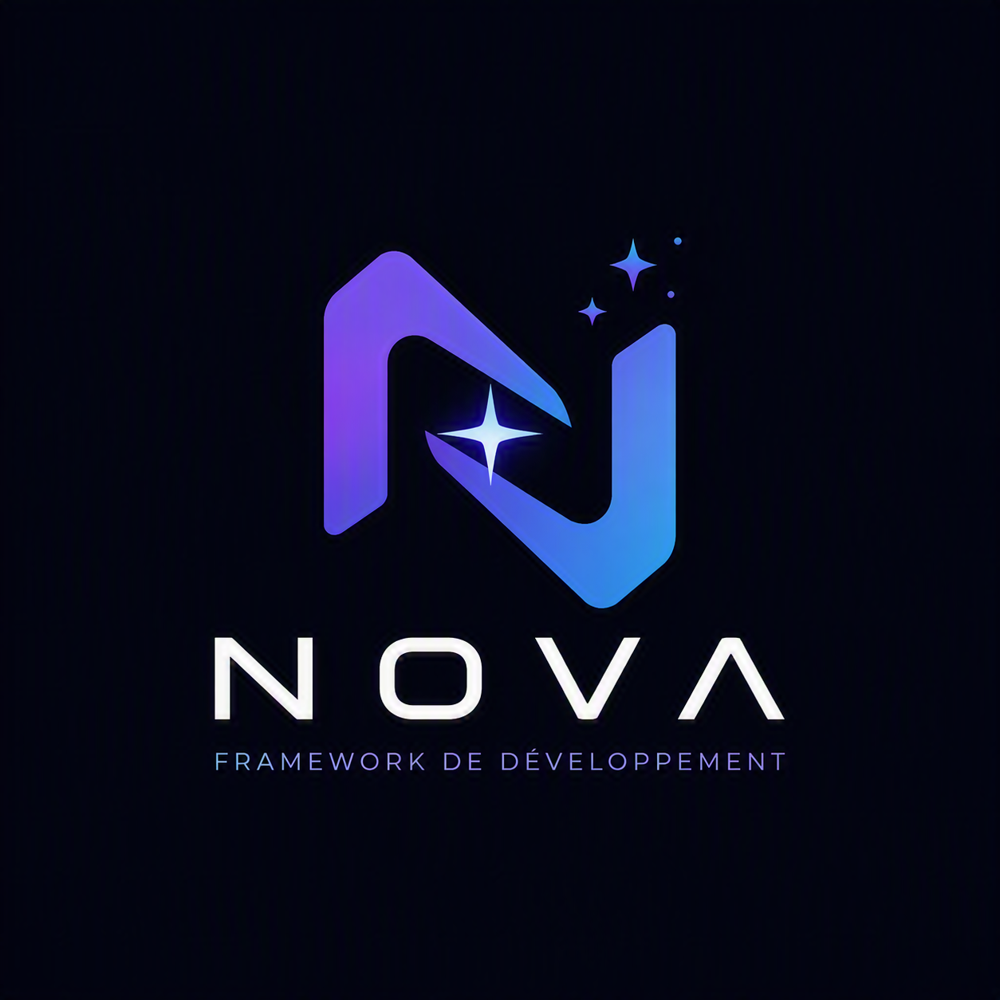
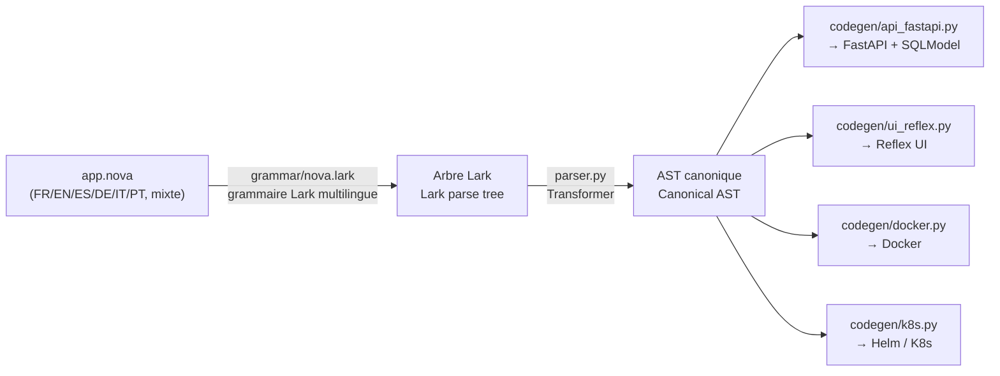

<div align="center">



# NOVA

**Un DSL multilingue (FR/EN/ES/DE/IT/PT) d'intention métier qui compile vers une API FastAPI (auth JWT, requêtes déclaratives), une UI Reflex stylable en CSS, des images Docker et des manifests Kubernetes/Helm.**
**A multilingual (FR/EN/ES/DE/IT/PT) business-intent DSL that compiles to a FastAPI API (JWT auth, declarative queries), a CSS-stylable Reflex UI, Docker images and Kubernetes/Helm manifests.**


[🇫🇷 Français](#-français) · [🇬🇧 English](#-english) · [Démarrage rapide](#démarrage-rapide--quickstart) · [Architecture](#architecture-du-compilateur--compiler-architecture) · [Licence](#licence--license)

</div>

---

Ce dépôt contient le compilateur NOVA (`nova_compiler/`), sa CLI (`nova`),
des exemples (`examples/`), les tests (`tests/`) et l'extension Visual
Studio Code (`vscode-extension/`) pour écrire des fichiers `.nova` avec
coloration syntaxique et snippets dans les deux langues.

This repo contains the NOVA compiler (`nova_compiler/`), its CLI (`nova`),
examples (`examples/`), tests (`tests/`), and the Visual Studio Code
extension (`vscode-extension/`) for writing `.nova` files with syntax
highlighting and snippets in either language.

> **Fair-source / Code source ouvert** — NOVA est distribué sous
> [Business Source License 1.1](LICENSE.md) : le code est ouvert et
> lisible par tous dès aujourd'hui, gratuit pour tout usage
> non-commercial, et bascule automatiquement sous licence Apache 2.0
> (100% permissive) quatre ans après chaque publication. Un usage
> commercial nécessite une licence payante — écrivez à
> **contact@enc-soft.com**. Voir [Licence](#licence--license) en bas de
> page pour le détail.
>
> NOVA is distributed under the [Business Source License 1.1](LICENSE.md):
> the code is open and readable by everyone today, free for any
> non-commercial use, and automatically converts to the fully permissive
> Apache 2.0 license four years after each release. Commercial use
> requires a paid license — reach out to **contact@enc-soft.com**. See
> [License](#licence--license) at the bottom of this page for details.

## Démarrage rapide / Quickstart

```bash
git clone git@github.com:Encryon/Nova.git nova-framework
cd nova-framework
python3 -m venv .venv && source .venv/bin/activate
pip install -e ".[dev]"

nova new mon_projet --lang fr        # ou --lang en
nova check mon_projet/app.nova
nova compile mon_projet/app.nova -o mon_projet/build
cd mon_projet/build && docker compose up --build
```

Backend sur `http://localhost:8000/docs` · Frontend sur `http://localhost:3000`.

## Architecture du compilateur / Compiler architecture



Le point clé : **tout le reste du compilateur ne voit jamais le texte
source**, seulement l'AST canonique — ajouter une langue ou un synonyme se
fait uniquement dans `nova_compiler/keywords.py` et la grammaire.
The key point: **the rest of the compiler never looks at the source
text**, only at the canonical AST — adding a language or a synonym only
touches `nova_compiler/keywords.py` and the grammar.

---

## 🇫🇷 Français

### Qu'est-ce que NOVA ?

NOVA est un langage d'intention métier : on décrit des **entités**, des
**API** et des **pages** à un niveau fonctionnel, et le compilateur génère
le code technique correspondant (modèles de données, routes CRUD, UI,
conteneurs, déploiement). Chaque mot-clé du langage existe en français et
en anglais et compile vers exactement le même arbre syntaxique — un même
fichier peut même mélanger les deux.

Stack cible actuelle (v0.2) : **Python / FastAPI** pour l'API,
**Reflex** (thème Radix, navigation, cartes) pour l'UI web, **Docker**
pour l'empaquetage, **Kubernetes (Helm, Traefik, HPA)** pour le
déploiement cloud-native. Authentification JWT avec rôles, requêtes
déclaratives au-delà du CRUD, et style CSS piloté depuis le DSL sont
disponibles en un bloc chacun — voir plus bas.

Chaque mot-clé du langage est reconnu en **6 langues** : français,
anglais, espagnol, allemand, italien, portugais — un même fichier peut
mélanger n'importe laquelle d'entre elles, elles compilent toutes vers
le même arbre syntaxique.

### Installation

```bash
cd nova-framework
python3 -m venv .venv && source .venv/bin/activate   # optionnel mais recommandé
pip install -e ".[dev]"
```

Installe la commande `nova` (voir `pyproject.toml`, `[project.scripts]`)
et les dépendances de dev (`pytest`).

### Syntaxe du DSL

```
application MaBoutique {
  nom: "Ma Boutique"
  langue: fr
}

entité Utilisateur {
  champ nom: chaine requis
  champ email: chaine requis unique motif = "^[^@]+@[^@]+$"
  champ age: entier
}

entité Commande {
  champ montant: decimal requis
  appartient_à Utilisateur
}

api Utilisateur {
  liste
  créer
  modifier
  supprimer
}

page ListeUtilisateurs {
  afficher Utilisateur comme table titre "Utilisateurs"
}
```

Voir `examples/blog.fr.nova` pour un exemple complet, et `examples/mixed.nova`
pour un fichier qui mélange français et anglais.

### Table des mots-clés

| Bloc / mot-clé | Français | Anglais |
|---|---|---|
| Application | `application` | `app` |
| Entité | `entité` / `entite` | `entity` |
| Champ | `champ` | `field` |
| Requis | `requis` | `required` |
| Unique | `unique` | `unique` |
| Validation regex | `motif` / `regex` | `pattern` |
| Valeur par défaut | `defaut` / `défaut` / `par_defaut` | `default` |
| Relation 1-N | `possede_plusieurs` / `possède_plusieurs` | `has_many` |
| Relation N-1 | `appartient_a` / `appartient_à` | `belongs_to` |
| API | `api` | `api` |
| Lister | `liste` | `list` |
| Créer | `creer` / `créer` | `create` |
| Modifier | `modifier` / `mettre_a_jour` / `mettre_à_jour` | `update` |
| Supprimer | `supprimer` | `delete` |
| Obtenir | `obtenir` / `lire` | `get` |
| Page | `page` | `page` |
| Afficher | `afficher` | `show` |
| Comme | `comme` | `as` |
| Titre | `titre` | `title` |
| Style | `style` | `style` / `css` |
| Auth | `authentification` | `auth` / `authentication` |
| Rôles | `rôles` / `roles` | `roles` |
| Protéger | `proteger` / `protéger` | `protect` |
| Requête | `requete` / `requête` | `query` |
| Filtre | `filtre` | `filter` |
| Trier par | `trier_par` | `sort_by` / `order_by` |
| Limite | `limite` | `limit` |
| Types | `chaine`/`chaîne`, `texte`, `entier`, `decimal`/`décimal`, `booleen`/`booléen`, `date`, `date_heure` | `string`, `text`, `int`, `float`, `bool`, `date`, `datetime` |

Ce tableau ne couvre que FR/EN pour rester lisible ; espagnol, allemand,
italien et portugais sont acceptés pour les mêmes mots-clés — voir
`nova_compiler/keywords.py` et `nova_compiler/grammar/nova.lark` pour la
liste complète des synonymes par langue.

### Validation par expression régulière

Un champ texte peut porter une contrainte `motif`/`pattern`/`regex` :

```
champ email: chaine requis motif = "^[^@]+@[^@]+$"
```

Génère automatiquement une contrainte Pydantic (`pattern=r"..."`) sur le
modèle de table SQLModel et sur les schémas `Create`/`Update` — l'API
rejette une valeur invalide avec un `422` sans code de validation à
écrire à la main.

### Style et CSS

Le bloc `application` accepte une propriété `css` (ou `feuille_style` /
`stylesheet`) : le fichier référencé, résolu relativement au `.nova`
source, est copié tel quel dans les assets du frontend Reflex généré et
chargé globalement (`rx.App(stylesheets=[...])`).

```
application MaBoutique {
  nom: "Ma Boutique"
  css: "theme.css"
}
```

Chaque `show` d'une page accepte en plus un bloc `style { ... }` (ou
`css { ... }`) libre : une clé connue (`couleur_fond`, `arrondi`,
`police`, `taille_police`, `epaisseur`, `marge`, `espacement`, `ombre`,
`largeur`, `hauteur`, `bordure`, `couleur`...) est traduite vers la
vraie propriété CSS ; toute autre clé passe telle quelle (snake_case ou
kebab-case, convertie en camelCase pour Reflex) — pas besoin d'attendre
que NOVA connaisse une propriété CSS pour l'utiliser. La clé spéciale
`classe` (ou `class`/`class_name`) injecte un `class_name=` Reflex,
utile pour accrocher une classe définie dans la feuille externe :

```
page Produits {
  afficher Produit comme table titre "Catalogue" style {
    couleur_fond: "#445566"
    arrondi: "12px"
    classe: "carte-produit"
  }
}
```

Voir `examples/full_featured.nova` et `examples/theme.css`.

### Authentification JWT et rôles

Un bloc `auth` optionnel (une seule fois par projet) active
l'authentification complète — table utilisateur, hachage de mot de
passe (`bcrypt`), jetons JWT (`python-jose`), routes `/auth/register`,
`/auth/login`, `/auth/me`, et une page de connexion Reflex générée
automatiquement (jeton persisté dans un cookie navigateur) :

```
auth {
  roles: admin, user, editeur
}
```

Une `api` se protège avec `proteger: <rôle>` (ou `protect`/`protéger`) :
toutes ses routes exigent alors un jeton valide portant ce rôle — un
utilisateur `admin` passe toujours, quel que soit le rôle requis.

```
api Produit {
  liste
  créer
  modifier
  supprimer
  proteger: admin
}
```

En production, définissez la variable d'environnement
`NOVA_JWT_SECRET` (le `docker-compose.yml` généré la référence déjà) —
la valeur par défaut ne doit jamais être utilisée telle quelle. Le
champ `role` de `/auth/register` est actuellement libre (n'importe qui
peut s'inscrire comme `admin`) : à restreindre côté `routers_custom/`
avant tout déploiement public.

### Requêtes déclaratives (`requete` / `query`)

Pour aller au-delà du CRUD simple sans écrire de route à la main, un
bloc `requete ... sur <Entité> { ... }` (ou `query ... on`/`query ...
from`) compile vers une route `GET` dédiée avec filtre, tri et limite :

```
requete ProduitsChers sur Produit {
  filtre: prix > 100
  trier_par: prix desc
  limite: 10
}
```

Génère `GET /requetes/produits-chers`, une requête SQLAlchemy lisible
(`select(...).where(...).order_by(...).limit(...)`) — pas de chaîne SQL
à écrire. Les comparateurs disponibles : `>`, `<`, `>=`, `<=`, `==`,
`!=`. Pour des filtres combinés, des jointures ou une logique plus
riche, `routers_custom/` reste le point d'extension prévu.

### Aller au-delà du DSL : points d'extension "custom"

Le DSL couvre le CRUD et l'UI simples. Pour tout le reste — requêtes
complexes, jointures, écritures en base sur mesure, validations croisant
plusieurs champs, UI hors du modèle table/formulaire/fiche — chaque
projet compilé contient deux emplacements créés **une seule fois** et
**jamais réécrits** aux compilations suivantes (contrairement au reste
du projet, toujours régénéré depuis l'AST) :

- `backend/app/routers_custom/*.py` — n'importe quel module exposant une
  variable `router` (`fastapi.APIRouter`) est automatiquement inclus dans
  l'application (boucle de découverte dans `main.py`).
- `frontend/<app>/custom.py` — une fonction `register(app)` appelée
  automatiquement après la création de `app = rx.App(...)`, pour ajouter
  des pages/composants Reflex sur mesure.

Un fichier d'exemple fonctionnel (routeur de test, validation regex avec
écriture en base, squelette de requête complexe) est généré dans
`routers_custom/example.py` au premier `nova compile`.

### Architecture du compilateur

Voir le diagramme en haut de page. Les 4 cibles de génération
(`codegen/api_fastapi.py`, `codegen/ui_reflex.py`, `codegen/docker.py`,
`codegen/k8s.py`) partagent le même AST et ne communiquent jamais entre
elles ni avec le texte source.

### Extension Visual Studio Code

Voir `vscode-extension/README.md`. Elle fournit coloration syntaxique,
snippets bilingues (`entity`/`entite`, `api`/`api-fr`, `page-table`/
`page-tableau`...) et des commandes pour appeler `nova check` / `nova
compile` / `nova new` sans quitter l'éditeur. La même grammaire TextMate
(`vscode-extension/syntaxes/nova.tmLanguage.json`) est réutilisable dans
Sublime Text ou Zed.

### Tests

```bash
pip install -e ".[dev]"
pytest tests/ -v
```

36 tests : équivalence structurelle FR/EN, synonymes ES/DE/IT/PT,
validité syntaxique du code généré, clés étrangères, setters de
formulaire Reflex, validation regex, style CSS, points d'extension
custom — dont plusieurs tests qui **importent réellement** le backend
généré et lui envoient de vraies requêtes HTTP (`TestClient`) : flux JWT
complet (inscription, connexion, rôles, routes protégées) et route de
requête déclarative, pas seulement une vérification de syntaxe.

### Limites connues du MVP

- Pluriel anglais naïf pour les noms de tables/routes.
- Une seule entité principale par bloc `page` (pas de composition
  multi-entités sur une même page).
- `has_many` est informatif (pas de colonne générée) ; seul
  `belongs_to` produit une clé étrangère.
- La validation `motif`/`pattern` ne couvre qu'un seul champ à la fois ;
  toute règle croisant plusieurs champs passe par `routers_custom/`.
- Le bloc `requete`/`query` ne couvre qu'un filtre simple par comparateur
  sur une seule entité (pas de `ET`/`OU` combinés, pas de jointure) ;
  au-delà, `routers_custom/`.
- `/auth/register` laisse le rôle libre par défaut — à restreindre avant
  un déploiement public (voir la section Authentification ci-dessus).
- Le chart Helm est un squelette à adapter (registre d'images, ingress réel).
- Pas encore de NOVA Studio (IDE dédié), Marketplace, NOVA Cloud, NOVA AI
  — ce dépôt couvre le compilateur (Phase 1/2 de la feuille de route).

---

## 🇬🇧 English

### What is NOVA?

NOVA is a business-intent language: you describe **entities**, **APIs**
and **pages** at a functional level, and the compiler generates the
matching technical code (data models, CRUD routes, UI, containers,
deployment manifests). Every keyword exists in both French and English
and compiles to the exact same syntax tree — a single file can even mix
both.

Current target stack (v0.2): **Python / FastAPI** for the API, **Reflex**
(Radix theme, navigation, cards) for the web UI, **Docker** for
packaging, **Kubernetes (Helm, Traefik, HPA)** for cloud-native
deployment. JWT authentication with roles, declarative queries beyond
CRUD, and DSL-driven CSS styling are each available as a single block —
see below.

Every keyword in the language is recognized in **6 languages**: French,
English, Spanish, German, Italian, Portuguese — a single file can mix
any of them, and they all compile to the exact same syntax tree.

### Installation

```bash
cd nova-framework
python3 -m venv .venv && source .venv/bin/activate   # optional but recommended
pip install -e ".[dev]"
```

Installs the `nova` command (see `pyproject.toml`, `[project.scripts]`)
and dev dependencies (`pytest`).

### DSL syntax

```
app MyShop {
  name: "My Shop"
  lang: en
}

entity User {
  field name: string required
  field email: string required unique pattern = "^[^@]+@[^@]+$"
  field age: int
}

entity Order {
  field amount: float required
  belongs_to User
}

api User {
  list
  create
  update
  delete
}

page UserList {
  show User as table title "Users"
}
```

See `examples/blog.en.nova` for a full example, and `examples/mixed.nova`
for a file mixing French and English.

### Keyword table

| Block / keyword | English | French |
|---|---|---|
| Application | `app` | `application` |
| Entity | `entity` | `entité` / `entite` |
| Field | `field` | `champ` |
| Required | `required` | `requis` |
| Unique | `unique` | `unique` |
| Regex validation | `pattern` | `motif` / `regex` |
| Default value | `default` | `defaut` / `défaut` / `par_defaut` |
| 1-N relation | `has_many` | `possede_plusieurs` / `possède_plusieurs` |
| N-1 relation | `belongs_to` | `appartient_a` / `appartient_à` |
| API | `api` | `api` |
| List | `list` | `liste` |
| Create | `create` | `creer` / `créer` |
| Update | `update` | `modifier` / `mettre_a_jour` |
| Delete | `delete` | `supprimer` |
| Get | `get` | `obtenir` / `lire` |
| Page | `page` | `page` |
| Show | `show` | `afficher` |
| As | `as` | `comme` |
| Title | `title` | `titre` |
| Style | `style` / `css` | `style` |
| Auth | `auth` / `authentication` | `authentification` |
| Roles | `roles` | `rôles` / `roles` |
| Protect | `protect` | `proteger` / `protéger` |
| Query | `query` | `requete` / `requête` |
| Filter | `filter` | `filtre` |
| Sort by | `sort_by` / `order_by` | `trier_par` |
| Limit | `limit` | `limite` |
| Types | `string`, `text`, `int`, `float`, `bool`, `date`, `datetime` | `chaine`/`chaîne`, `texte`, `entier`, `decimal`/`décimal`, `booleen`/`booléen`, `date`, `date_heure` |

This table only covers EN/FR for readability; Spanish, German, Italian
and Portuguese are accepted for the same keywords — see
`nova_compiler/keywords.py` and `nova_compiler/grammar/nova.lark` for
the full per-language synonym list.

### Regex field validation

A text field can carry a `pattern`/`motif`/`regex` constraint:

```
field email: string required pattern = "^[^@]+@[^@]+$"
```

Automatically generates a Pydantic `pattern=r"..."` constraint on the
SQLModel table and on the `Create`/`Update` schemas — the API rejects an
invalid value with a `422`, no hand-written validation code needed.

### Style and CSS

The `application` block accepts a `css` property (or `feuille_style` /
`stylesheet`): the referenced file, resolved relative to the source
`.nova` file, is copied as-is into the generated Reflex frontend's
assets and loaded globally (`rx.App(stylesheets=[...])`).

```
app MyShop {
  name: "My Shop"
  css: "theme.css"
}
```

Each `show` in a page also accepts a free-form `style { ... }` (or
`css { ... }`) block: a known key (`couleur_fond`/`background`,
`arrondi`/`border_radius`, `police`/`font_family`, `font_size`,
`font_weight`, `margin`, `padding`, `box_shadow`, `width`, `height`,
`border`, `color`...) is translated to the real CSS property; any other
key is passed through as-is (snake_case or kebab-case, converted to
camelCase for Reflex) — no need to wait for NOVA to know about a CSS
property before using it. The special `class`/`classe`/`class_name` key
injects a Reflex `class_name=`, handy for hooking into a class defined
in the external stylesheet:

```
page Products {
  show Product as table title "Catalog" style {
    background: "#445566"
    border_radius: "12px"
    class_name: "product-card"
  }
}
```

See `examples/full_featured.nova` and `examples/theme.css`.

### JWT authentication and roles

An optional `auth` block (once per project) enables full
authentication — a user table, password hashing (`bcrypt`), JWT tokens
(`python-jose`), `/auth/register`, `/auth/login`, `/auth/me` routes, and
an auto-generated Reflex login page (token persisted in a browser
cookie):

```
auth {
  roles: admin, user, editor
}
```

An `api` is protected with `protect: <role>` (or `proteger`/`protéger`):
every route on it then requires a valid token carrying that role — an
`admin` user always passes, whatever role is required.

```
api Product {
  list
  create
  update
  delete
  protect: admin
}
```

In production, set the `NOVA_JWT_SECRET` environment variable (the
generated `docker-compose.yml` already references it) — never use the
default value as-is. The `role` field on `/auth/register` is currently
unrestricted (anyone can register as `admin`) — lock this down in
`routers_custom/` before any public deployment.

### Declarative queries (`query` / `requete`)

To go beyond simple CRUD without hand-writing a route, a `query ...
on/from <Entity> { ... }` block (or `requete ... sur`) compiles to a
dedicated `GET` route with filtering, sorting and a limit:

```
query ExpensiveProducts on Product {
  filter: price > 100
  sort_by: price desc
  limit: 10
}
```

Generates `GET /requetes/expensive-products`, a readable SQLAlchemy
query (`select(...).where(...).order_by(...).limit(...)`) — no SQL
string to write. Available comparators: `>`, `<`, `>=`, `<=`, `==`,
`!=`. For combined filters, joins, or richer logic, `routers_custom/`
remains the intended extension point.

### Beyond the DSL: "custom" extension points

The DSL covers simple CRUD and UI. For everything else — complex
queries, joins, custom database writes, cross-field validation, UI
outside the table/form/card model — every compiled project ships two
locations created **once** and **never overwritten** by later
compilations (unlike the rest of the project, always regenerated from
the AST):

- `backend/app/routers_custom/*.py` — any module exposing a `router`
  variable (`fastapi.APIRouter`) is automatically included in the app
  (discovery loop in `main.py`).
- `frontend/<app>/custom.py` — a `register(app)` function automatically
  called right after `app = rx.App(...)` is created, for hand-written
  Reflex pages/components.

A working example file (test route, regex validation with a database
write, a complex-query skeleton) is generated in
`routers_custom/example.py` on first `nova compile`.

### Compiler architecture

See the diagram at the top of this page. The 4 codegen targets
(`codegen/api_fastapi.py`, `codegen/ui_reflex.py`, `codegen/docker.py`,
`codegen/k8s.py`) share the same AST and never talk to each other or to
the source text.

### Visual Studio Code extension

See `vscode-extension/README.md`. It provides syntax highlighting,
bilingual snippets (`entity`/`entite`, `api`/`api-fr`, `page-table`/
`page-tableau`...) and commands to run `nova check` / `nova compile` /
`nova new` without leaving the editor. The same TextMate grammar
(`vscode-extension/syntaxes/nova.tmLanguage.json`) is reusable in Sublime
Text or Zed.

### Tests

```bash
pip install -e ".[dev]"
pytest tests/ -v
```

36 tests: FR/EN structural equivalence, ES/DE/IT/PT synonyms,
generated-code syntactic validity, foreign keys, explicit Reflex form
setters, regex validation, CSS styling, custom extension points —
including several tests that **actually import** the generated backend
and send it real HTTP requests (`TestClient`): a full JWT flow
(register, login, roles, protected routes) and the declarative-query
route, not just a syntax check.

### Known MVP limitations

- Naive English pluralization for table/route names.
- A single main entity per `page` block (no multi-entity composition
  yet).
- `has_many` is informational only (no column generated); only
  `belongs_to` produces a foreign key.
- `pattern`/`motif` validation covers a single field at a time; any rule
  spanning multiple fields belongs in `routers_custom/`.
- The `query`/`requete` block only covers a single comparator-based
  filter on one entity (no combined `AND`/`OR`, no joins); beyond that,
  `routers_custom/`.
- `/auth/register` leaves the role unrestricted by default — lock this
  down before a public deployment (see the Authentication section
  above).
- The Helm chart is a skeleton meant to be adapted (image registry, real
  ingress).
- Not yet included: NOVA Studio (dedicated IDE), Marketplace, NOVA
  Cloud, NOVA AI — this repo covers the compiler (roadmap Phase 1/2).

---

## Licence / License

**Business Source License 1.1** (fair-source) — texte complet dans
[`LICENSE.md`](LICENSE.md).

- 🇫🇷 **Gratuit** pour tout usage non-commercial : projets personnels,
  formation, évaluation, contributions à ce dépôt.
- 🇫🇷 **Usage commercial** (en entreprise, dans un produit ou service
  vendu, en hébergement) → licence commerciale requise auprès d'ENC-SOFT :
  **contact@enc-soft.com**.
- 🇫🇷 **Bascule automatique** vers la licence **Apache 2.0** (permissive)
  quatre ans après la publication de chaque version — pour la v0.2.0,
  le **2030-09-08**.

- 🇬🇧 **Free** for any non-commercial use: personal projects, education,
  evaluation, contributions to this repository.
- 🇬🇧 **Commercial use** (inside a business, in a product or service you
  sell, or as a hosted offering) → requires a commercial license from
  ENC-SOFT: **contact@enc-soft.com**.
- 🇬🇧 **Automatic conversion** to the permissive **Apache 2.0** license
  four years after each version's publication — for v0.2.0, on
  **2030-09-08**.

Le code, les marques « NOVA » et le logo restent la propriété d'ENC-SOFT.
The NOVA code, name, and logo remain the property of ENC-SOFT.
