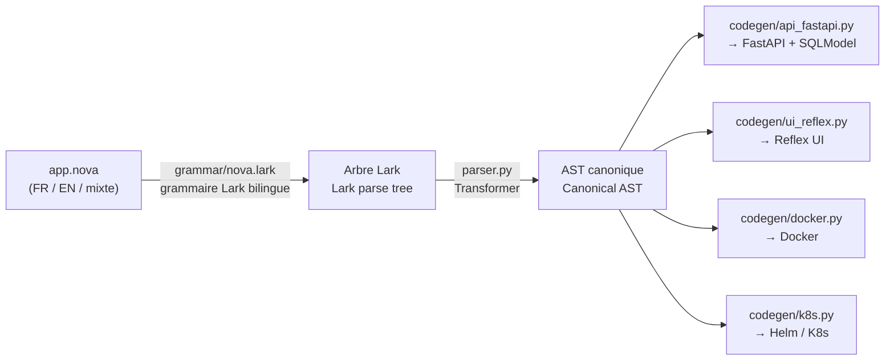

<div align="center">

# NOVA

**Un DSL bilingue (FR/EN) d'intention métier qui compile vers une API FastAPI, une UI Reflex, des images Docker et des manifests Kubernetes/Helm.**
**A bilingual (FR/EN) business-intent DSL that compiles to a FastAPI API, a Reflex UI, Docker images and Kubernetes/Helm manifests.**


[🇫🇷 Français](#-français) · [🇬🇧 English](#-english) · [Démarrage rapide](#démarrage-rapide--quickstart) · [Architecture](#architecture-du-compilateur--compiler-architecture)

</div>

---

Ce dépôt contient le compilateur NOVA (`nova_compiler/`), sa CLI (`nova`),
des exemples (`examples/`), les tests (`tests/`) et l'extension Visual
Studio Code (`vscode-extension/`) pour écrire des fichiers `.nova` avec
coloration syntaxique et snippets dans les deux langues.

This repo contains the NOVA compiler (`nova_compiler/`), its CLI (`nova`),
examples (`examples/`), tests (`tests/`), and the Visual Studio Code
extension (`vscode-extension/`) for writing `.nova` files with syntax
highlighting and snippets in either language.

> **Confidentialité / Confidentiality** — Dépôt privé ENC-SOFT / Encryon,
> usage interne et partenaires techniques uniquement. Private ENC-SOFT /
> Encryon repository, internal and technical-partner use only. Voir
> [Licence](#licence--license) en bas de page.

## Démarrage rapide / Quickstart

```bash
git clone git@github.com:Encryon/Nova.git nova-framework
cd nova-framework
python3 -m venv .venv && source .venv/bin/activate
pip install -e ".[dev]"

nova new mon_projet --lang fr        # ou --lang en
nova check mon_projet/app.nova
nova compile mon_projet/app.nova -o mon_projet/build
cd mon_projet/build && docker compose up --build
```

Backend sur `http://localhost:8000/docs` · Frontend sur `http://localhost:3000`.

## Architecture du compilateur / Compiler architecture



Le point clé : **tout le reste du compilateur ne voit jamais le texte
source**, seulement l'AST canonique — ajouter une langue ou un synonyme se
fait uniquement dans `nova_compiler/keywords.py` et la grammaire.
The key point: **the rest of the compiler never looks at the source
text**, only at the canonical AST — adding a language or a synonym only
touches `nova_compiler/keywords.py` and the grammar.

---

## 🇫🇷 Français

### Qu'est-ce que NOVA ?

NOVA est un langage d'intention métier : on décrit des **entités**, des
**API** et des **pages** à un niveau fonctionnel, et le compilateur génère
le code technique correspondant (modèles de données, routes CRUD, UI,
conteneurs, déploiement). Chaque mot-clé du langage existe en français et
en anglais et compile vers exactement le même arbre syntaxique — un même
fichier peut même mélanger les deux.

Stack cible actuelle (v0.2) : **Python / FastAPI** pour l'API,
**Reflex** (thème Radix, navigation, cartes) pour l'UI web, **Docker**
pour l'empaquetage, **Kubernetes (Helm, Traefik, HPA)** pour le
déploiement cloud-native.

### Installation

```bash
cd nova-framework
python3 -m venv .venv && source .venv/bin/activate   # optionnel mais recommandé
pip install -e ".[dev]"
```

Installe la commande `nova` (voir `pyproject.toml`, `[project.scripts]`)
et les dépendances de dev (`pytest`).

### Syntaxe du DSL

```
application MaBoutique {
  nom: "Ma Boutique"
  langue: fr
}

entité Utilisateur {
  champ nom: chaine requis
  champ email: chaine requis unique motif = "^[^@]+@[^@]+$"
  champ age: entier
}

entité Commande {
  champ montant: decimal requis
  appartient_à Utilisateur
}

api Utilisateur {
  liste
  créer
  modifier
  supprimer
}

page ListeUtilisateurs {
  afficher Utilisateur comme table titre "Utilisateurs"
}
```

Voir `examples/blog.fr.nova` pour un exemple complet, et `examples/mixed.nova`
pour un fichier qui mélange français et anglais.

### Table des mots-clés

| Bloc / mot-clé | Français | Anglais |
|---|---|---|
| Application | `application` | `app` |
| Entité | `entité` / `entite` | `entity` |
| Champ | `champ` | `field` |
| Requis | `requis` | `required` |
| Unique | `unique` | `unique` |
| Validation regex | `motif` / `regex` | `pattern` |
| Valeur par défaut | `defaut` / `défaut` / `par_defaut` | `default` |
| Relation 1-N | `possede_plusieurs` / `possède_plusieurs` | `has_many` |
| Relation N-1 | `appartient_a` / `appartient_à` | `belongs_to` |
| API | `api` | `api` |
| Lister | `liste` | `list` |
| Créer | `creer` / `créer` | `create` |
| Modifier | `modifier` / `mettre_a_jour` / `mettre_à_jour` | `update` |
| Supprimer | `supprimer` | `delete` |
| Obtenir | `obtenir` / `lire` | `get` |
| Page | `page` | `page` |
| Afficher | `afficher` | `show` |
| Comme | `comme` | `as` |
| Titre | `titre` | `title` |
| Types | `chaine`/`chaîne`, `texte`, `entier`, `decimal`/`décimal`, `booleen`/`booléen`, `date`, `date_heure` | `string`, `text`, `int`, `float`, `bool`, `date`, `datetime` |

### Validation par expression régulière

Un champ texte peut porter une contrainte `motif`/`pattern`/`regex` :

```
champ email: chaine requis motif = "^[^@]+@[^@]+$"
```

Génère automatiquement une contrainte Pydantic (`pattern=r"..."`) sur le
modèle de table SQLModel et sur les schémas `Create`/`Update` — l'API
rejette une valeur invalide avec un `422` sans code de validation à
écrire à la main.

### Aller au-delà du DSL : points d'extension "custom"

Le DSL couvre le CRUD et l'UI simples. Pour tout le reste — requêtes
complexes, jointures, écritures en base sur mesure, validations croisant
plusieurs champs, UI hors du modèle table/formulaire/fiche — chaque
projet compilé contient deux emplacements créés **une seule fois** et
**jamais réécrits** aux compilations suivantes (contrairement au reste
du projet, toujours régénéré depuis l'AST) :

- `backend/app/routers_custom/*.py` — n'importe quel module exposant une
  variable `router` (`fastapi.APIRouter`) est automatiquement inclus dans
  l'application (boucle de découverte dans `main.py`).
- `frontend/<app>/custom.py` — une fonction `register(app)` appelée
  automatiquement après la création de `app = rx.App(...)`, pour ajouter
  des pages/composants Reflex sur mesure.

Un fichier d'exemple fonctionnel (routeur de test, validation regex avec
écriture en base, squelette de requête complexe) est généré dans
`routers_custom/example.py` au premier `nova compile`.

### Architecture du compilateur

Voir le diagramme en haut de page. Les 4 cibles de génération
(`codegen/api_fastapi.py`, `codegen/ui_reflex.py`, `codegen/docker.py`,
`codegen/k8s.py`) partagent le même AST et ne communiquent jamais entre
elles ni avec le texte source.

### Extension Visual Studio Code

Voir `vscode-extension/README.md`. Elle fournit coloration syntaxique,
snippets bilingues (`entity`/`entite`, `api`/`api-fr`, `page-table`/
`page-tableau`...) et des commandes pour appeler `nova check` / `nova
compile` / `nova new` sans quitter l'éditeur. La même grammaire TextMate
(`vscode-extension/syntaxes/nova.tmLanguage.json`) est réutilisable dans
Sublime Text ou Zed.

### Tests

```bash
pip install -e ".[dev]"
pytest tests/ -v
```

22 tests : équivalence structurelle FR/EN, validité syntaxique du code
généré, clés étrangères, setters de formulaire Reflex, validation regex,
points d'extension custom — dont un test qui **importe réellement** le
backend généré et lui envoie une requête HTTP (`TestClient`), pas
seulement une vérification de syntaxe.

### Limites connues du MVP

- Pluriel anglais naïf pour les noms de tables/routes.
- Une seule entité principale par bloc `page` (pas de composition
  multi-entités sur une même page).
- `has_many` est informatif (pas de colonne générée) ; seul
  `belongs_to` produit une clé étrangère.
- La validation `motif`/`pattern` ne couvre qu'un seul champ à la fois ;
  toute règle croisant plusieurs champs passe par `routers_custom/`.
- Le chart Helm est un squelette à adapter (registre d'images, ingress réel).
- Pas encore de NOVA Studio (IDE dédié), Marketplace, NOVA Cloud, NOVA AI
  — ce dépôt couvre le compilateur (Phase 1/2 de la feuille de route).

---

## 🇬🇧 English

### What is NOVA?

NOVA is a business-intent language: you describe **entities**, **APIs**
and **pages** at a functional level, and the compiler generates the
matching technical code (data models, CRUD routes, UI, containers,
deployment manifests). Every keyword exists in both French and English
and compiles to the exact same syntax tree — a single file can even mix
both.

Current target stack (v0.2): **Python / FastAPI** for the API, **Reflex**
(Radix theme, navigation, cards) for the web UI, **Docker** for
packaging, **Kubernetes (Helm, Traefik, HPA)** for cloud-native
deployment.

### Installation

```bash
cd nova-framework
python3 -m venv .venv && source .venv/bin/activate   # optional but recommended
pip install -e ".[dev]"
```

Installs the `nova` command (see `pyproject.toml`, `[project.scripts]`)
and dev dependencies (`pytest`).

### DSL syntax

```
app MyShop {
  name: "My Shop"
  lang: en
}

entity User {
  field name: string required
  field email: string required unique pattern = "^[^@]+@[^@]+$"
  field age: int
}

entity Order {
  field amount: float required
  belongs_to User
}

api User {
  list
  create
  update
  delete
}

page UserList {
  show User as table title "Users"
}
```

See `examples/blog.en.nova` for a full example, and `examples/mixed.nova`
for a file mixing French and English.

### Keyword table

| Block / keyword | English | French |
|---|---|---|
| Application | `app` | `application` |
| Entity | `entity` | `entité` / `entite` |
| Field | `field` | `champ` |
| Required | `required` | `requis` |
| Unique | `unique` | `unique` |
| Regex validation | `pattern` | `motif` / `regex` |
| Default value | `default` | `defaut` / `défaut` / `par_defaut` |
| 1-N relation | `has_many` | `possede_plusieurs` / `possède_plusieurs` |
| N-1 relation | `belongs_to` | `appartient_a` / `appartient_à` |
| API | `api` | `api` |
| List | `list` | `liste` |
| Create | `create` | `creer` / `créer` |
| Update | `update` | `modifier` / `mettre_a_jour` |
| Delete | `delete` | `supprimer` |
| Get | `get` | `obtenir` / `lire` |
| Page | `page` | `page` |
| Show | `show` | `afficher` |
| As | `as` | `comme` |
| Title | `title` | `titre` |
| Types | `string`, `text`, `int`, `float`, `bool`, `date`, `datetime` | `chaine`/`chaîne`, `texte`, `entier`, `decimal`/`décimal`, `booleen`/`booléen`, `date`, `date_heure` |

### Regex field validation

A text field can carry a `pattern`/`motif`/`regex` constraint:

```
field email: string required pattern = "^[^@]+@[^@]+$"
```

Automatically generates a Pydantic `pattern=r"..."` constraint on the
SQLModel table and on the `Create`/`Update` schemas — the API rejects an
invalid value with a `422`, no hand-written validation code needed.

### Beyond the DSL: "custom" extension points

The DSL covers simple CRUD and UI. For everything else — complex
queries, joins, custom database writes, cross-field validation, UI
outside the table/form/card model — every compiled project ships two
locations created **once** and **never overwritten** by later
compilations (unlike the rest of the project, always regenerated from
the AST):

- `backend/app/routers_custom/*.py` — any module exposing a `router`
  variable (`fastapi.APIRouter`) is automatically included in the app
  (discovery loop in `main.py`).
- `frontend/<app>/custom.py` — a `register(app)` function automatically
  called right after `app = rx.App(...)` is created, for hand-written
  Reflex pages/components.

A working example file (test route, regex validation with a database
write, a complex-query skeleton) is generated in
`routers_custom/example.py` on first `nova compile`.

### Compiler architecture

See the diagram at the top of this page. The 4 codegen targets
(`codegen/api_fastapi.py`, `codegen/ui_reflex.py`, `codegen/docker.py`,
`codegen/k8s.py`) share the same AST and never talk to each other or to
the source text.

### Visual Studio Code extension

See `vscode-extension/README.md`. It provides syntax highlighting,
bilingual snippets (`entity`/`entite`, `api`/`api-fr`, `page-table`/
`page-tableau`...) and commands to run `nova check` / `nova compile` /
`nova new` without leaving the editor. The same TextMate grammar
(`vscode-extension/syntaxes/nova.tmLanguage.json`) is reusable in Sublime
Text or Zed.

### Tests

```bash
pip install -e ".[dev]"
pytest tests/ -v
```

22 tests: FR/EN structural equivalence, generated-code syntactic
validity, foreign keys, explicit Reflex form setters, regex validation,
custom extension points — including a test that **actually imports** the
generated backend and sends it a real HTTP request (`TestClient`), not
just a syntax check.

### Known MVP limitations

- Naive English pluralization for table/route names.
- A single main entity per `page` block (no multi-entity composition
  yet).
- `has_many` is informational only (no column generated); only
  `belongs_to` produces a foreign key.
- `pattern`/`motif` validation covers a single field at a time; any rule
  spanning multiple fields belongs in `routers_custom/`.
- The Helm chart is a skeleton meant to be adapted (image registry, real
  ingress).
- Not yet included: NOVA Studio (dedicated IDE), Marketplace, NOVA
  Cloud, NOVA AI — this repo covers the compiler (roadmap Phase 1/2).

---

## Licence / License

Propriétaire — ENC-SOFT / Encryon. Usage interne et partenaires
techniques uniquement, sauf accord contraire. Ce dépôt est **privé** ;
ne pas redistribuer le code sans autorisation.

Proprietary — ENC-SOFT / Encryon. Internal and technical-partner use
only, unless otherwise agreed. This repository is **private**; do not
redistribute the code without authorization.
